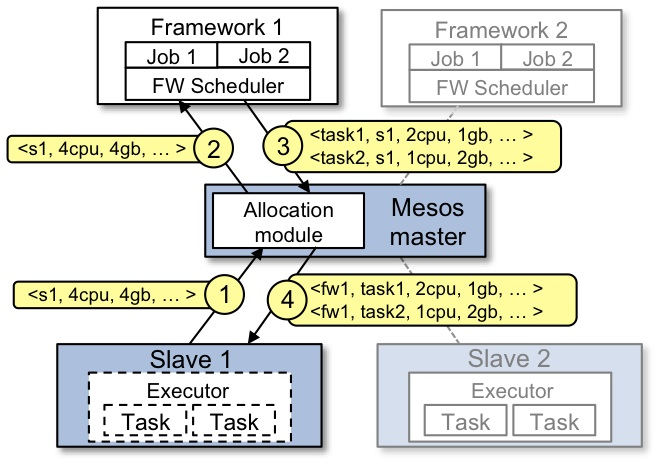

# Mesos Architecture

The above figure shows the main components of Mesos.  Mesos consists of a *master* daemon that manages *agent* daemons running on each cluster node, and *Mesos frameworks* that run *tasks* on these agents.

The master enables fine-grained sharing of resources (CPU, RAM, ...) across
frameworks by making them *resource offers*. Each resource offer contains a list
of `<agent ID, resource1: amount1, resource2: amount2, ...>` (NOTE: as
keyword 'slave' is deprecated in favor of 'agent', driver-based frameworks will
still receive offers with slave ID, whereas frameworks using the v1 HTTP API receive offers with agent ID). The master decides *how many* resources to offer to each framework according to a given organizational policy, such as fair sharing or strict priority. To support a diverse set of policies, the master employs a modular architecture that makes it easy to add new allocation modules via a plugin mechanism.

A framework running on top of Mesos consists of two components: a *scheduler* that registers with the master to be offered resources, and an *executor* process that is launched on agent nodes to run the framework's tasks (see the [App/Framework development guide](app-framework-development-guide.md) for more details about framework schedulers and executors). While the master determines **how many** resources are offered to each framework, the frameworks' schedulers select **which** of the offered resources to use. When a framework accepts offered resources, it passes to Mesos a description of the tasks it wants to run on them. In turn, Mesos launches the tasks on the corresponding agents.

## Example of resource offer

The figure below shows an example of how a framework gets scheduled to run a task.

Let's walk through the events in the figure.

1. Agent 1 reports to the master that it has 4 CPUs and 4 GB of memory free. The master then invokes the allocation policy module, which tells it that framework 1 should be offered all available resources.
1. The master sends a resource offer describing what is available on agent 1 to framework 1.
1. The framework's scheduler replies to the master with information about two tasks to run on the agent, using <2 CPUs, 1 GB RAM> for the first task, and <1 CPUs, 2 GB RAM> for the second task.
1. Finally, the master sends the tasks to the agent, which allocates appropriate resources to the framework's executor, which in turn launches the two tasks (depicted with dotted-line borders in the figure). Because 1 CPU and 1 GB of RAM are still unallocated, the allocation module may now offer them to framework 2.

In addition, this resource offer process repeats when tasks finish and new resources become free.

While the thin interface provided by Mesos allows it to scale and allows the frameworks to evolve independently, one question remains: how can the constraints of a framework be satisfied without Mesos knowing about these constraints? For example, how can a framework achieve data locality without Mesos knowing which nodes store the data required by the framework? Mesos answers these questions by simply giving frameworks the ability to **reject** offers. A framework will reject the offers that do not satisfy its constraints and accept the ones that do.  In particular, we have found that a simple policy called delay scheduling, in which frameworks wait for a limited time to acquire nodes storing the input data, yields nearly optimal data locality.

You can also read much more about the Mesos architecture in this [technical paper](https://www.usenix.org/conference/nsdi11/mesos-platform-fine-grained-resource-sharing-data-center).
