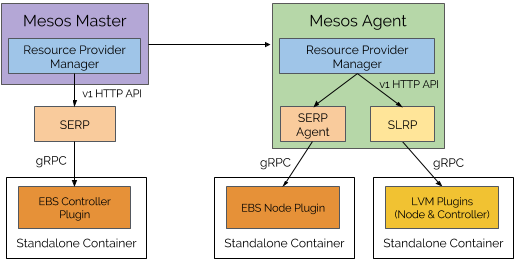

# Container Storage Interface (CSI) Support

This document describes the [Container Storage Interface](https://github.com/container-storage-interface/spec)
(CSI) support in Mesos.

Currently, only CSI spec version 0.2 is supported in Mesos 1.6+ due to
incompatible changes between CSI version 0.1 and version 0.2. CSI version 0.1 is
supported in Mesos 1.5.

## Motivation

### Current Limitations of Storage Support in Mesos

Prior to 1.5, Mesos supports both [local persistent volumes](persistent-volume.md)
as well as [external persistent volumes](isolators/docker-volume.md). However,
both of them have limitations.

[Local persistent volumes](persistent-volume.md) do not support offering
physical or logical block devices directly. Frameworks do not have the choice to
select filesystems for their local persistent volumes. Although Mesos does
support [multiple local disks](multiple-disk.md), it's a big burden for
operators to configure each agent properly to be able to leverage this feature.
Finally, there is no well-defined interface allowing third-party storage vendors
to plug into Mesos.

[External persistent volumes](isolators/docker-volume.md) support in Mesos
bypasses the resource management part. In other words, using an external
persistent volume does not go through the usual offer cycle. Mesos does not
track resources associated with the external volumes. This makes quota control,
reservation, and fair sharing almost impossible to enforce. Also, the current
interface Mesos uses to interact with storage vendors is the
[Docker Volume Driver Interface](https://docs.docker.com/engine/extend/plugins_volume/)
(DVDI), which has several [limitations](https://docs.google.com/document/d/125YWqg_5BB5OY9a6M7LZcby5RSqBwo2PZzpVLuxYXh4/edit?usp=sharing).

### Container Storage Interface (CSI)

[Container Storage Interface](https://github.com/container-storage-interface/spec)
(CSI) is a specification that defines a common set of APIs for all interactions
between the storage vendors and the container orchestration platforms. It is the
result of a [close collaboration](https://github.com/container-storage-interface/community)
among representatives from the [Kubernetes](https://kubernetes.io/),
[CloudFoundry](https://www.cloudfoundry.org/), [Docker](https://www.docker.com/)
and Mesos communities. The primary goal of CSI is to allow storage vendors to
write one plugin that works with all container orchestration platforms.

It was an easy decision to build the storage support in Mesos using CSI. The
benefits are clear: it will fit Mesos into the larger storage ecosystem in a
consistent way. In other words, users will be able to use any storage system
with Mesos using a consistent API. The out-of-tree plugin model of CSI decouples
the release cycle of Mesos from that of the storage systems, making the
integration itself more sustainable and maintainable.

## Architecture

The following figure provides an overview about how Mesos supports CSI.



### First Class Storage Resource Provider

The [resource provider](resource-provider.md) abstraction is a natural fit for
supporting storage and CSI. Since CSI standardizes the interface between
container orchestrators and storage vendors, the implementation for the storage
resource provider should be the same for all storage systems that are
CSI-compatible.

As a result, Mesos provides a default implementation of LRP, called Storage
Local Resource Provider (SLRP), to provide general support for storage and CSI.
Storage External Resource Provider (SERP) support is [coming soon](https://issues.apache.org/jira/browse/MESOS-8371).
The storage resource providers serve as the bridges between Mesos and CSI plugins.

More details about SLRP can be found in the following [section](#storage-local-resource-provider).

### Standalone Containers for CSI Plugins

CSI plugins are long-running [gRPC](https://grpc.io/) services, like daemons.
Those CSI plugins are packaged as containers, and are launched by SLRPs using
the [standalone containers](standalone-containers.md) API from the agent.
Standalone containers can be launched without any tasks or executors. They use
the same isolation mechanism provided by the agent for task and executor
containers.

There is a component in each SLRP that is responsible for monitoring the health
of the CSI plugin containers and restarting them if needed.

## Framework API

### New Disk Source Types

Two new types of disk sources have been added: `RAW` and `BLOCK`.

```protobuf
message Resource {
  message DiskInfo {
    message Source {
      enum Type {
        PATH = 1;
        MOUNT = 2;
        BLOCK = 3;  // New in 1.5
        RAW = 4;    // New in 1.5
      }
      optional Type type = 1;
    }
  }
}
```

The disk source type (i.e., `DiskInfo::Source::Type`) specifies the property of
a disk resource and how it can be consumed.

* `PATH`: The disk resource can be accessed using the Volume API (backed by a
  POSIX compliant filesystem). The disk resource can be carved up into smaller
  chunks.
* `MOUNT`: The disk resource can be accessed using the Volume API (backed by a
  POSIX compliant filesystem). The disk resource cannot be carved up into
  smaller chunks.
* `BLOCK`: (New in 1.5) The disk resource can be directly accessed on Linux
  without any filesystem (e.g., `/dev/sdb`). The disk resource cannot be carved
  up into smaller chunks.
* `RAW`: (New in 1.5) The disk resource cannot be accessed by the framework yet.
  It has to be [converted](#new-offer-operations-for-disk-resources) into any of
  the above types before it can be accessed. The disk resource cannot be carved
  up into smaller chunks if it has an [ID](#disk-id-and-metadata) (i.e.,
  [pre-existing disks](#pre-existing-disks)), and can be carved up into smaller
  chunks if it does not have an [ID](#disk-id-and-metadata) (i.e.,
  [storage pool](#storage-pool)).

### Disk ID and Metadata

Two more fields have been added to `DiskInfo.Source` to further describe the
disk source. It also allows CSI plugins to propagate plugin-specific information
to the framework.

```protobuf
message Resource {
  message DiskInfo {
    message Source {
      // An identifier for this source. This field maps onto CSI
      // volume IDs and is not expected to be set by frameworks.
      optional string id = 4;

      // Additional metadata for this source. This field maps onto CSI
      // volume metadata and is not expected to be set by frameworks.
      optional Labels metadata = 5;
    }
  }
}
```

* `id`: This maps to CSI [Volume ID](https://github.com/container-storage-interface/spec/blob/v0.1.0/spec.md#createvolume)
  if the disk resource is backed by a [Volume](https://github.com/container-storage-interface/spec/blob/v0.1.0/spec.md#terminology)
  from a CSI plugin. This field must not be set by frameworks.
* `metadata`: This maps to CSI [Volume Attributes](https://github.com/container-storage-interface/spec/blob/v0.1.0/spec.md#createvolume)
  if the disk resource is backed by a [Volume](https://github.com/container-storage-interface/spec/blob/v0.1.0/spec.md#terminology)
  from a CSI plugin. This field must not be set by frameworks.

### Storage Pool

A `RAW` disk resource may or may not have an ID (i.e., `DiskInfo.Source.id`),
depending on whether or not the `RAW` disk resource is backed by a CSI Volume. A
`RAW` disk resource not backed by a CSI Volume is usually referred to as a
storage pool (e.g., an LVM volume group, or EBS storage space, etc.).

The size of the storage pool is reported by the CSI plugin using the
[`GetCapacity` interface](https://github.com/container-storage-interface/spec/blob/v0.1.0/spec.md#getcapacity).

Currently, a storage pool must have a [profile](#profiles) defined. Any disk
resource created from the storage pool inherits the same profile as the storage
pool. See more details in the [profiles](#profiles) section.

### Pre-existing Disks

A `RAW` disk resource with an ID (i.e., `DiskInfo.Source.id`) is referred to as
a [pre-existing disk](#pre-existing-disks).  Pre-existing disks are those
[CSI Volumes](https://github.com/container-storage-interface/spec/blob/v0.1.0/spec.md#terminology)
that are detected by the corresponding CSI plugin using the
[`ListVolumes` interface](https://github.com/container-storage-interface/spec/blob/v0.1.0/spec.md#listvolumes),
but have not gone through the dynamic provisioning process (i.e., via `CREATE_DISK`).

For example, operators might pre-create some LVM logical volumes before
launching Mesos. Those pre-created LVM logical volumes will be reported by the
LVM CSI plugin when Mesos invokes the `ListVolumes` interface, thus will be
reported as pre-existing disks in Mesos.

Currently, pre-existing disks do not have [profiles](#profiles). This may change
in the near future. See more details in the [profiles](#profiles) section.

### New Offer Operations for Disk Resources

To allow dynamic provisioning of disk resources, two new offer operations have
been added to the [scheduler API](scheduler-http-api.md#accept):
`CREATE_DISK` and `DESTROY_DISK`.

To learn how to use the offer operations, please refer to the
[`ACCEPT`](scheduler-http-api.md#accept) Call in the v1 scheduler API, or
[`acceptOffers`](app-framework-development-guide.md#api) method in the v0
scheduler API for more details.

```protobuf
message Offer {
  message Operation {
    enum Type {
      UNKNOWN = 0;
      LAUNCH = 1;
      LAUNCH_GROUP = 6;
      RESERVE = 2;
      UNRESERVE = 3;
      CREATE = 4;
      DESTROY = 5;
      GROW_VOLUME = 11;
      SHRINK_VOLUME = 12;
      CREATE_DISK = 13;   // New in 1.7.
      DESTROY_DISK = 14;  // New in 1.7.
    }
    optional Type type = 1;
  }
}
```

#### `CREATE_DISK` operation

The offer operation `CREATE_DISK` takes a `RAW` disk resource
(`create_disk.source`), and create a `MOUNT` or a `BLOCK` disk resource
(`create_disk.target_type`) from the source. The source `RAW` disk resource can
either be a storage pool (i.e., a `RAW` disk resource without an ID) or a
pre-existing disk (i.e., a `RAW` disk resource with an ID). The quantity of the
converted resource (either `MOUNT` or `BLOCK` disk resource) will be the same as
the source `RAW` resource.

```protobuf
message Offer {
  message Operation {
    message CreateDisk {
      required Resource source = 1;
      required Resource.DiskInfo.Source.Type target_type = 2;
    }
    optional CreateDisk create_disk = 15;
  }
}
```

The created disk resource will have the disk [`id` and `metadata`](#disk-id-and-metadata)
set accordingly to uniquely identify the volume reported by the CSI plugin.

Note that `CREATE_DISK` is different than [`CREATE`](persistent-volume.md).
`CREATE` creates a [persistent volume](persistent-volume.md) which indicates
that the data stored in the volume will be persisted until the framework
explicitly destroys it. It must operate on a non-`RAW` disk resource (i.e.,
`PATH`, `MOUNT` or `BLOCK`).

#### `DESTROY_DISK` operation

The offer operation `DESTROY_DISK` destroys a `MOUNT` or a `BLOCK` disk resource
(`destroy_disk.source`), which will result in a `RAW` disk resource. The
quantity of the `RAW` disk resource will be the same as the specified `source`,
unless it has an invalid profile (described later), in which case the
`DESTROY_DISK` operation will completely remove the disk resource.

```protobuf
message Offer {
  message Operation {
    message DestroyDisk {
      required Resource source = 1;
    }
    optional DestroyDisk destroy_disk = 16;
  }
}
```

This operation is intended to be a reverse operation of `CREATE_DISK`. In
other words, if the volume is created from a storage pool (i.e., a `RAW` disk
resource without an ID), the result of the corresponding `DESTROY_DISK` should
be a storage pool. And if the volume is created from a [pre-existing disk](#pre-existing-disks)
(i.e., a `RAW` disk resource with an ID), the result of the corresponding
`DESTROY_DISK` should be a pre-existing disk.

Currently, Mesos infers the result based on the presence of an assigned
[profile](#profiles) in the disk resource. In other words, if the volume to be
destroyed has a profile, the converted `RAW` disk resource will be a storage
pool (i.e., `RAW` disk resource without an ID). Otherwise, the converted `RAW`
disk resource will be a pre-existing disk (i.e., `RAW` disk resource with an
ID). This leverages the fact that currently, each storage pool must have a
profile, and pre-existing disks do not have profiles.

#### Getting Operation Results

It is important for the frameworks to get the results of the above offer
operations so that they know if the dynamic disk provisioning is successful or
not.

Starting with Mesos 1.6.0 it is possible to opt-in to receive status updates
related to operations that affect resources managed by a resource provider. In
order to do so, the framework has to set the `id` field in the operation.
Support for operations affecting the agent default resources is [coming
soon](https://issues.apache.org/jira/browse/MESOS-8194).

## Profiles

The primary goal of introducing profiles is to provide an indirection to a set
of storage vendor-specific parameters for the disk resources. It provides a way
for the cluster operator to describe the classes of storage they offer and
abstracts away the low-level details of a storage system.

Each profile is just a simple string (e.g., "fast", "slow", "gold"), as
described below:

```protobuf
message Resource {
  message DiskInfo {
    message Source {
      // This field serves as an indirection to a set of storage
      // vendor specific disk parameters which describe the properties
      // of the disk. The operator will setup mappings between a
      // profile name to a set of vendor specific disk parameters. And
      // the framework will do disk selection based on profile names,
      // instead of vendor specific disk parameters.
      //
      // Also see the DiskProfile module.
      optional string profile = 6;
    }
  }
}
```

A typical framework that needs storage is expected to perform disk
resource selection based on the `profile` of a disk resource, rather
than low-level storage vendor specific parameters.

### Disk Profile Adaptor Module

In order to let cluster operators customize the mapping between profiles and
storage system-specific parameters, Mesos provides a [module](modules.md)
interface called `DiskProfileAdaptor`.

```cpp
class DiskProfileAdaptor
{
public:
  struct ProfileInfo
  {
    csi::VolumeCapability capability;
    google::protobuf::Map<std::string, std::string> parameters;
  };

  virtual Future<ProfileInfo> translate(
      const std::string& profile,
      const ResourceProviderInfo& resourceProviderInfo) = 0;

  virtual Future<hashset<std::string>> watch(
      const hashset<std::string>& knownProfiles,
      const ResourceProviderInfo& resourceProviderInfo) = 0;
};
```

The module interface has a `translate` method that takes a profile and returns
the corresponding [CSI volume capability](https://github.com/container-storage-interface/spec/blob/v0.1.0/spec.md#createvolume)
(i.e., the `capability` field) and [CSI volume creation parameters](https://github.com/container-storage-interface/spec/blob/v0.1.0/spec.md#createvolume)
(i.e., the `parameters` field) for that profile. These two fields will be used to
call the CSI `CreateVolume` interface during dynamic provisioning (i.e.,
`CREATE_DISK`), or CSI `ControllerPublishVolume` and
`NodePublishVolume` when publishing (i.e., when a task using the disk resources
is being launched on a Mesos agent).

The `watch` method in the module interface allows Mesos to get notified about
the changes on the profiles. It takes a list of known profiles and returns a
future which will be set if the module detects changes to the known profiles
(e.g., a new profile is added).  Currently, all profiles are immutable, thus are
safe to cache.

Since `ProfileInfo` uses protobuf from the CSI spec directly, there is an
implicit dependency between backward compatibility of the module interface and
the CSI spec version. Since CSI doesn't provide a backward compatibility
promise, modules have to be re-built against each release of Mesos.

### URI Disk Profile Adaptor

To demonstrate how to use the disk profile adaptor module, Mesos ships with a
default disk profile adaptor, called `UriDiskProfileAdaptor`. This module
polls the profile information (in JSON) from a configurable URI. Here are the
module parameters that can be used to configure the module:

* `uri`: URI to a JSON object containing the profile mapping. The module
  supports both HTTP(s) and file URIs. The JSON object should consist of some
  top-level string keys corresponding to the disk profile name. Each value
  should contain a `ResourceProviderSelector` under `resource_provider_selector`
  or a `CSIPluginTypeSelector` under `csi_plugin_type_selector` to specify the
  set of resource providers this profile applies to, followed by a
  `VolumeCapability` under `volume_capabilities` and arbitrary key-value pairs
  under `create_parameters`. For example:

```json
{
  "profile_matrix": {
    "my-profile": {
      "csi_plugin_type_selector": {
        "plugin_type": "org.apache.mesos.csi.test"
      },
      "volume_capabilities": {
        "mount": {
          "fs_type": "xfs"
        },
        "access_mode": {
          "mode": "SINGLE_NODE_WRITER"
        }
      },
      "create_parameters": {
        "type": "raid5",
        "stripes": "3",
        "stripesize": "64"
      }
    }
  }
}
```
* `poll_interval`: How long to wait between polling the specified `uri`.  If the
  poll interval has elapsed since the last fetch, then the URI is re-fetched;
  otherwise, a cached `ProfileInfo` is returned. If not specified, the URI is
  only fetched once.
* `max_random_wait`: How long at most to wait between discovering a new set of
  profiles and notifying the callers of `watch`. The actual wait time is a
  uniform random value between 0 and this value. If the `--uri` points to a
  centralized location, it may be good to scale this number according to the
  number of resource providers in the cluster.  [default: 0secs]

To enable this module, please follow the [modules documentation](modules.md):
add the following JSON to the `--modules` agent flag, and set agent flag
`--disk_profile_adaptor` to `org_apache_mesos_UriDiskProfileAdaptor`.

```json
{
  "libraries": [
    {
      "file": "/PATH/TO/liburi_disk_profile.so",
      "modules": [
        {
          "name": "org_apache_mesos_UriDiskProfileAdaptor",
          "parameters": [
            {
              "key": "uri",
              "value": "/PATH/TO/my_profile.json"
            },
            {
              "key": "poll_interval",
              "value": "1secs"
            }
          ]
        }
      ]
    }
  ]
}
```

### Storage Pool Capacity and Profiles

The capacity of a [storage pool](#storage-pool) is usually tied to the profiles
of the volumes that the users want to provision from the pool. For instance,
consider an LVM volume group (a storage pool) backed by 1000G of physical
volumes. The capacity of the storage pool will be 1000G if the logical volumes
provisioned from the pool have `"raid0"` configuration, and will be 500G if the
logical volumes provisioned from the pool have `"raid1"` configuration.

In fact, it does not make sense to have a storage pool that does not have a
profile because otherwise the allocator or the framework will not be able to
predict how much space a volume will take, making resource management almost
impossible to implement.

Therefore, each storage pool must have a profile associated with it. The profile
of a storage pool is the profile of the volumes that can be provisioned from the
pool. In other words, the volumes provisioned from a storage pool inherit the
profile of the storage pool.

Mesos gets the capacity of a storage pool with a given profile by invoking the
CSI [`GetCapacity` interface](https://github.com/container-storage-interface/spec/blob/v0.1.0/spec.md#getcapacity)
with the corresponding volume capability and parameters associated with the
profile.

It is possible that a storage system is able to provide volumes with different
profiles. For example, the LVM volume group is able to produce both raid0 and
raid1 logical volumes, backed by the same physical volumes. In that case, Mesos
will report one storage pool per profile. In this example, assuming there are
two profiles: `"raid0"` and `"raid1"`, Mesos will report 2 `RAW` disk resources:

1. 1000G `RAW` disk resource with profile `"raid0"`
2. 500G `RAW` disk resource with profile `"raid1"`.

TODO(jieyu): Discuss correlated resources.

## Storage Local Resource Provider

[Resource Provider](resource-provider.md) is an abstraction in Mesos allowing
cluster administrators to customize the providing of resources and the handling
of operations related to the provided resources.

For storage and CSI support, Mesos provides a default implementation of the
resource provider interface that serves as the bridge between Mesos and the CSI
plugins. It is called the Storage Resource Provider. It is responsible for
launching CSI plugins, talking to CSI plugins using the gRPC protocol, reporting
available disk resources, handling offer operations from frameworks, and making
disk resources available on the agent where the disk resources are used.

Currently, each Storage Resource Provider instance manages exactly one CSI
plugin. This simplifies reasoning and implementation.

In Mesos 1.5, only the Storage Local Resource Provider (SLRP) is supported. This
means the disk resources it reports are tied to a particular agent node, and
thus cannot be used on other nodes. The Storage External Resource Provider
(SERP) is [coming soon](https://issues.apache.org/jira/browse/MESOS-8371).

### Enable gRPC Support

[gRPC](https://grpc.io/) must be enabled to support SLRP. To enable gRPC
support, configure Mesos with `--enable-grpc`.

### Enable Agent Resource Provider Capability

In order to use SLRPs, the agent needs to be configured to enable resource
provider support. Since resource provider support is an experimental feature, it
is not turned on by default in 1.5. To enable that, please set the agent flag
`--agent_features` to the following JSON:

```json
{
  "capabilities": [
    {"type": "MULTI_ROLE"},
    {"type": "HIERARCHICAL_ROLE"},
    {"type": "RESERVATION_REFINEMENT"},
    {"type": "RESOURCE_PROVIDER"}
  ]
}
```

Note that although capabilities `MULTI_ROLE`, `HIERARCHICAL_ROLE` and
`RESERVATION_REFINEMENT` are not strictly necessary for supporting resources
providers, these must be specified because the agent code already assumes those
capabilities are set, and the old code that assumes those capabilities not being
set has already been removed.

### SLRP Configuration

Each SLRP configures itself according to its `ResourceProviderInfo` which is
specified by the operator.

```protobuf
message ResourceProviderInfo {
  required string type = 3;
  required string name = 4;
  repeated Resource.ReservationInfo default_reservations = 5;

  // Storage resource provider related information.
  message Storage {
    required CSIPluginInfo plugin = 1;
  }

  optional Storage storage = 6;
}
```

* `type`: The type of the resource provider. This uniquely identifies a resource
  provider implementation. For instance: `"org.apache.mesos.rp.local.storage"`.
  The naming of the `type` field should follow the
  [Java package naming convention](https://en.wikipedia.org/wiki/Java_package#Package_naming_conventions)
  to avoid conflicts on the type names.
* `name`: The name of the resource provider. There could be multiple instances
  of a type of resource provider. The name field is used to distinguish these
  instances. It should be a legal [Java identifier](https://docs.oracle.com/javase/tutorial/java/nutsandbolts/variables.html)
  to avoid conflicts on concatenation of type and name.
* `default_reservations`: If set, any new resources from this resource provider
  will be reserved by default. The first `ReservationInfo` may have type
  `STATIC` or `DYNAMIC`, but the rest must have `DYNAMIC`. One can create a new
  reservation on top of an existing one by pushing a new `ReservationInfo` to
  the back. The last `ReservationInfo` in this stack is the "current"
  reservation. The new reservation's role must be a child of the current one.
* `storage`: Storage resource provider specific information (see more details
  below).

```protobuf
message CSIPluginInfo {
  required string type = 1;
  required string name = 2;
  repeated CSIPluginContainerInfo containers = 3;
}
```

* `type`: The type of the CSI plugin. This uniquely identifies a CSI plugin
  implementation. For instance: `"org.apache.mesos.csi.test"`.  The naming
  should follow the [Java package naming convention](https://en.wikipedia.org/wiki/Java_package#Package_naming_conventions)
  to avoid conflicts on type names.
* `name`: The name of the CSI plugin. There could be multiple instances of the
  same type of CSI plugin. The name field is used to distinguish these
  instances. It should be a legal [Java identifier](https://docs.oracle.com/javase/tutorial/java/nutsandbolts/variables.html)
  to avoid conflicts on concatenation of type and name.
* `containers`: CSI plugin container configurations (see more details below).
  The [CSI controller service](https://github.com/container-storage-interface/spec/blob/v0.1.0/spec.md#controller-service-rpc)
  will be served by the first that contains `CONTROLLER_SERVICE`, and the
  [CSI node service](https://github.com/container-storage-interface/spec/blob/v0.1.0/spec.md#node-service-rpc)
  will be served by the first that contains `NODE_SERVICE`.

```protobuf
message CSIPluginContainerInfo {
  enum Service {
    UNKNOWN = 0;
    CONTROLLER_SERVICE = 1;
    NODE_SERVICE = 2;
  }

  repeated Service services = 1;
  optional CommandInfo command = 2;
  repeated Resource resources = 3;
  optional ContainerInfo container = 4;
}
```

* `services`: Whether the CSI plugin container provides the
  [CSI controller service](https://github.com/container-storage-interface/spec/blob/v0.1.0/spec.md#controller-service-rpc),
  the [CSI node service](https://github.com/container-storage-interface/spec/blob/v0.1.0/spec.md#node-service-rpc)
  or both.
* `command`: The command to launch the CSI plugin container.
* `resources`: The resources to be used for the CSI plugin container.
* `container`: The additional `ContainerInfo` about the CSI plugin container.

Note that each CSI plugin will have all isolation mechanisms configured on the
agent applied to it.

#### Sample SLRP Configuration

The following is a sample SLRP configuration that uses the [test CSI plugin](https://github.com/apache/mesos/blob/1.5.x/src/examples/test_csi_plugin.cpp)
provided by Mesos that provides both CSI controller and node services, and sets
the default reservation to `"test-role"`. The test CSI plugin will be built if
you configure Mesos with `--enable-tests-install`.

```json
{
  "type": "org.apache.mesos.rp.local.storage",
  "name": "test_slrp",
  "default_reservations": [
    {
      "type": "DYNAMIC",
      "role": "test-role"
    }
  ],
  "storage": {
    "plugin": {
      "type": "org.apache.mesos.csi.test",
      "name": "test_plugin",
      "containers": [
        {
          "services": [ "CONTROLLER_SERVICE", "NODE_SERVICE" ],
          "command": {
            "shell": true,
            "value": "./test-csi-plugin --available_capacity=2GB --work_dir=workdir",
            "uris": [
              {
                "value": "/PATH/TO/test-csi-plugin",
                "executable": true
              }
            ]
          },
          "resources": [
            { "name": "cpus", "type": "SCALAR", "scalar": { "value": 0.1 } },
            { "name": "mem", "type": "SCALAR", "scalar": { "value": 200.0 } }
          ]
        }
      ]
    }
  }
}
```

### SLRP Management

#### Launching SLRP

To launch a SLRP, place the SLRP configuration JSON described in the
[previous section](#slrp-configuration) in a directory (e.g.,
`/etc/mesos/resource-providers`) and set the agent flag
`--resource_provider_config_dir` to point to that directory. The corresponding
SLRP will be loaded by the agent. It is possible to put multiple SLRP
configuration JSON files under that directory to instruct the agent to load
multiple SLRPs.

Alternatively, it is also possible to dynamically launch a SLRP using the [agent
v1 operator API](operator-http-api.md#agent-api). To use that, still set the
agent flag `--resource_provider_config_dir` to point to a configuration
directory (the directory maybe empty). Once the agent is launched, hit the agent
`/api/v1` endpoint using the [`ADD_RESOURCE_PROVIDER_CONFIG`](operator-http-api.md#add_resource_provider_config)
call:

For example, here is the `curl` command to launch a SLRP:

```shell
curl -X POST -H 'Content-Type: application/json' -d '{"type":"ADD_RESOURCE_PROVIDER_CONFIG","add_resource_provider_config":{"info":<SLRP_JSON_CONFIG>}}' http://<agent_ip>:<agent_port>/api/v1
```

#### Updating SLRP

A SLRP can be updated by modifying the JSON configuration file. Once the
modification is done, restart the agent to pick up the new configuration.

Alternatively, the operator can dynamically update a SLRP using the [agent v1
operator API](operator-http-api.md#agent-api). When the agent is running, hit
the agent `/api/v1` endpoint using the
[`UPDATE_RESOURCE_PROVIDER_CONFIG`](operator-http-api.md#update_resource_provider_config)
call:

For example, here is the `curl` command to update a SLRP:

```shell
curl -X POST -H 'Content-Type: application/json' -d '{"type":"UPDATE_RESOURCE_PROVIDER_CONFIG","update_resource_provider_config":{"info":<NEW_SLRP_JSON_CONFIG>}}' http://<agent_ip>:<agent_port>/api/v1
```

*NOTE*: Currently, only `storage.containers` in the `ResourceProviderInfo` can
be updated. This allows operators to update the CSI plugin (e.g., upgrading)
without affecting running tasks and executors.

#### Removing SLRP

Removing a SLRP means that the agent will terminate the existing SLRP if it is
still running, and will no longer launch the SLRP during startup. The master and
the agent will think the SLRP has disconnected, similar to agent disconnection.
If there exists a task that is using the disk resources provided by the SLRP,
its execution will not be affected. However, offer operations (e.g.,
`CREATE_DISK`) for the SLRP will not be successful. In fact, if a SLRP is
disconnected, the master will rescind the offers related to that SLRP,
effectively disallowing frameworks to perform operations on the disconnected
SLRP.

The SLRP can be re-added after its removal following the same instructions of
[launching a SLRP](#launching-slrp). Note that removing a SLRP is different than
marking a SLRP as gone, in which case the SLRP will not be allowed to be
re-added. Marking a SLRP as gone is not yet supported.

A SLRP can be removed by removing the JSON configuration file from the
configuration directory (`--resource_provider_config_dir`). Once the removal is
done, restart the agent to pick up the removal.

Alternatively, the operator can dynamically remove a SLRP using the
[agent v1 operator API](operator-http-api.md#agent-api). When the agent is
running, hit the agent `/api/v1` endpoint using the
[`REMOVE_RESOURCE_PROVIDER_CONFIG`](operator-http-api.md#remove_resource_provider_config)
call:

For example, here is the `curl` command to update a SLRP:

```shell
curl -X POST -H 'Content-Type: application/json' -d '{"type":"REMOVE_RESOURCE_PROVIDER_CONFIG","remove_resource_provider_config":{"type":"org.apache.mesos.rp.local.storage","name":<SLRP_NAME>}}' http://<agent_ip>:<agent_port>/api/v1
```

#### Authorization

A new authorization action `MODIFY_RESOURCE_PROVIDER_CONFIG` has been added.
This action applies to adding/updating/removing a SLRP.

For the default Mesos local authorizer, a new ACL
`ACL.ModifyResourceProviderConfig` has been added, allowing operators limit the
access to the above API endpoints.

```protobuf
message ACL {
  // Which principals are authorized to add, update and remove resource
  // provider config files.
  message ModifyResourceProviderConfig {
    // Subjects: HTTP Username.
    required Entity principals = 1;

    // Objects: Given implicitly.
    // Use Entity type ANY or NONE to allow or deny access.
    required Entity resource_providers = 2;
  }
}
```

Currently, the `Objects` has to be either `ANY` or `NONE`. Fine-grained
authorization of specific resource provider objects is not yet supported. Please
refer to the [authorization doc](authorization.md) for more details about the
default Mesos local authorizer.

### Standalone Containers for CSI Plugins

As already mentioned earlier, each SLRP instance manages exactly one CSI plugin.
Each CSI plugin consists of one or more containers containing run processes that
implement both the [CSI controller service](https://github.com/container-storage-interface/spec/blob/v0.1.0/spec.md#controller-service-rpc)
and the [CSI node service](https://github.com/container-storage-interface/spec/blob/v0.1.0/spec.md#node-service-rpc).

The CSI plugin containers are managed by the SLRP automatically. The operator
does not need to deploy them manually. The SLRP will make sure that the CSI
plugin containers are running and restart them if needed (e.g., failed).

The CSI plugin containers are launched using the standalone container API
provided by the Mesos agent. See more details about standalone container in the
[standalone container doc](standalone-container.md).

## Limitations

* Only local disk resources are supported currently. That means the disk
  resources are tied to a particular agent node and cannot be used on a
  different agent node. The external disk resources support is coming soon.
* The CSI plugin container cannot be a Docker container yet. Storage vendors
  currently should package the CSI plugins in binary format and use the
  [fetcher](fetcher.md) to fetch the binary executable.
* `BLOCK` type disk resources are not supported yet.
