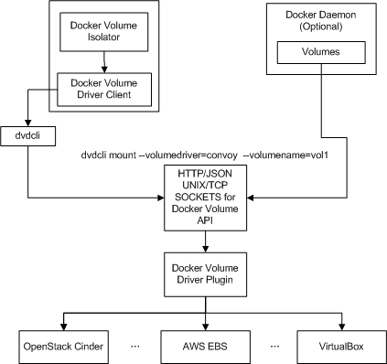

# Docker Volume Support in Mesos Containerizer

Mesos 1.0 adds the Docker volume support for MesosContainerizer (a.k.a., the
unified containerizer) by introducing a new isolator, called `docker/volume`
isolator.

This document describes the motivation, overall architecture, configuration
steps for enabling Docker volume isolator, and required framework changes.

## Table of Contents
- [Motivation](#motivation)
- [How does it work?](#how-does-it-work)
- [Configuration](#configuration)
  - [Pre-conditions](#pre-conditions)
  - [Configuring Docker Volume Isolator](#configure-Docker-volume-isolator)
  - [Enabling frameworks for Docker volume support](#enable-frameworks)
    - [Volume Protobuf](#volume-protobuf)
    - [Examples](#examples)
- [Limitations](#limitations)

## <a name="motivation"></a>Motivation

The integration of external storage in Mesos is an attractive feature.
Currently, the [persistent volume](persistent-volume.md) primitives in Mesos
allows stateful services to persist their data locally on an agent. However, the
size of a local disk is limited. For certain applications (e.g., databases),
external storage is desired as they might require much larger storage. External
storage support also makes data migration between agents/containers possible.

The [Docker Volume Driver
API](https://github.com/Docker/Docker/blob/master/docs/extend/plugins_volume.md)
defines the interfaces between the container runtime and the external storage
systems. It has been widely adopted. There are now many different Docker volume
plugins, including [Convoy plugin](https://github.com/rancher/convoy), [Flocker
plugin](https://docs.clusterhq.com/en/latest/Docker-integration/), [GlusterFS
plugin](https://github.com/calavera/Docker-volume-glusterfs), [REX-Ray
plugin](https://github.com/emccode/rexray) etc. Those plugins usually support a
variety of external storage systems like Amazon EBS, OpenStack Cinder, etc.

Therefore, introducing support for external storage in Mesos through the
`docker/volume` isolator provides Mesos with tremendous flexibility to
orchestrate containers on a wide variety of external storage technologies.

## <a name="how-does-it-work"></a>How does it work?



The `docker/volume` isolator interacts with Docker volume plugins using
[dvdcli](https://github.com/emccode/dvdcli), a command line tool from EMC.

When a new task with Docker volumes is launched, the `docker/volume` isolator
will invoke [dvdcli](https://github.com/emccode/dvdcli) to mount the
corresponding Docker volume onto the host and then onto the container.

When the task finishes or is killed, the `docker/volume` isolator will invoke
[dvdcli](https://github.com/emccode/dvdcli) to unmount the corresponding Docker
volume.

The detailed workflow for `docker/volume` isolator is as follows:

1. A framework specifies external volumes in `ContainerInfo` when launching the
   task.

2. The master sends the launch task message to the agent.

3. The agent receives the message and asks all isolators (including the
   `docker/volume` isolator) to prepare for the container with the
   `ContainerInfo`.

4. The isolator invokes [dvdcli](https://github.com/emccode/dvdcli) to mount the
   corresponding external volume to a mount point on the host.

5. The agent launches the container and bind mount the volume into the
   container.

6. The bind mounted volume inside the container will be unmounted from the
   container automatically when the container finishes as the container is in
   its own mount namespace.

7. The agent invokes isolator cleanup which invokes
   [dvdcli](https://github.com/emccode/dvdcli) to unmount all mount points for
   the container.

## <a name="configuration"></a>Configuration

To use the `docker/volume` isolator, there are certain actions required by the
operator and the framework developers. In this section we list the steps
required by the operator to configure `docker/volume` isolator and the steps
required by framework developers to specify the Docker volumes.

### <a name="pre-conditions"></a>Pre-conditions

- Have `dvdcli` with version
  [0.1.0](https://github.com/emccode/dvdcli/releases/tag/v0.1.0) installed.

- Install [Docker volume
  plugin](https://github.com/Docker/Docker/blob/master/docs/extend/plugins.md#volume-plugins)
on `each agent`.

- Have Docker volumes created explicitly before used by Mesos. Otherwise volumes
  will be created by [dvdcli](https://github.com/emccode/dvdcli) implicitly but
  the volumes may not fit into framework resoure requirement well.

### <a name="configure-Docker-volume-isolator"></a>Configuring Docker Volume Isolator

In order to configure the `docker/volume` isolator, the operator needs to
configure two flags at agent startup as follows:

```{.console}
  sudo Mesos-slave \
    --master=<master IP> \
    --ip=<Agent IP> \
    --work_dir=/var/lib/mesos \
    --isolation=filesystem/linux,docker/volume \
    --docker_volume_checkpoint_dir=<mount info checkpoint path>
```

The `docker/volume` isolator must be specified in the `--isolation` flag at
agent startup, and the `docker/volume` isolator has a dependency on
`filesystem/linux` isolator.

The `--docker_volume_checkpoint_dir` is an optional flag with a default value
`/var/run/Mesos/isolators/docker/volume`. The `docker/volume` isolator will
checkpoint all Docker volume mount points information under
`--docker_volume_checkpoint_dir` for recovery. The checkpoint information under
the default `--docker_volume_checkpoint_dir` will be cleaned up after agent
restart. Therefore, it is recommended to update the
`--docker_volume_checkpoint_dir` to a directory which can survive agent restart.

### <a name="enable-frameworks"></a>Enabling frameworks for Docker volume support

#### <a name="volume-protobuf"></a>Volume Protobuf

The `Volume` protobuf info has been updated to support the Docker volume.

```{.proto}
message Volume {
  ...

  required string container_path = 1;

  message Source {
    enum Type {
      UNKNOWN = 0;
      DOCKER_VOLUME = 1;
    }

    message DockerVolume {
      optional string driver = 1;
      required string name = 2;
      optional Parameters driver_options = 3;
    }

    optional Type type = 1;
    optional DockerVolume docker_volume = 2;
  }

  optional Source source = 5;
}
```

When requesting Docker volume for a container, the framework developer needs to
set `Volume` for the container, which includes `mode`, `container_path` and
`source`.

The `Source` specifies where the volume comes from. Framework developers need to
specify the `Type`, Docker volume `driver`, `name` and `options`. Only
`DOCKER_VOLUME` type is supported currently, and we plan to add more types in
the future.

How to specify `container_path`:

1. If you are launching a Mesos container `without rootfs`. If `container_path`
   is an absolute path, you need to make sure the absolute path exists on your
   host root file system as the container shares the host root file system;
   otherwise, the task will fail.

2. For other cases like launching a Mesos container `without rootfs` and
   `container_path` is a relative path, or launching a task `with rootfs` and
   `container_path` is an absolute path, or launching a task `with rootfs` and
   `container_path` as a relative path, the isolator will help create the
   `container_path` as the mount point.

The following table describes the above rules for `container_path`:

<table class="table table-striped">
  <tr>
    <th></th>
    <th>Container with rootfs</th>
    <th>Container without rootfs</th>
  </tr>
  <tr>
    <td>Absolute container_path</td>
    <td>No need to exist</td>
    <td>Must exist</td>
  </tr>
  <tr>
    <td>Relative container_path</td>
    <td>No need to exist</td>
    <td>No need to exist</td>
  </tr>
</table>

#### <a name="examples"></a>Examples

1. Launch a task with one Docker volume using the default command executor.

   ```{.json}
   TaskInfo {
     ...
     "command" : ...,
     "container" : {
       "volumes" : [
         {
           "container_path" : "/mnt/volume",
           "mode" : "RW",
           "source": {
             "type" : "DOCKER_VOLUME",
             "docker_volume" : {
               "driver" : "rexray",
               "name" : "myvolume"
             }
           }
         }
       ]
     }
   }
   ```

2. Launch a task with two Docker volumes using the default command executor.


   ```{.json}
   TaskInfo {
     ...
     "command" : ...,
     "container" : {
       "volumes" : [
         {
           "container_path" : "volume1",
           "mode" : "RW",
           "source" : {
             "type" : "DOCKER_VOLUME",
             "docker_volume" : {
               "driver" : "rexray",
               "name" : "volume1"
             }
           }
         },
         {
           "container_path" : "volume2",
           "mode" : "RW",
           "source" : {
             "type" : "DOCKER_VOLUME",
             "docker_volume" : {
               "driver" : "rexray",
               "name" : "volume2",
               "driver_options" : {
                 "parameter":[{
                   "key": <key>,
                   "value": <value>
                 }, {
                   "key": <key>,
                   "value": <value>
                 }]
               }
             }
           }
         }
       ]
     }
   }
   ```

**NOTE**: The task launch will be failed if one container using multiple Docker
volumes with same `driver` and `name`.

## <a name="limitations"></a>Limitations

It is highly recommended not to use the same Docker volume in both
DockerContainerizer and MesosContainerizer simultaneously, because
MesosContainerizer has its own reference couting to decide when to unmount the
Docker volume mount point. Otherwise, it would be problematic if a Docker volume
is unmounted by MesosContainerizer but the DockerContainerizer is still using
it.
