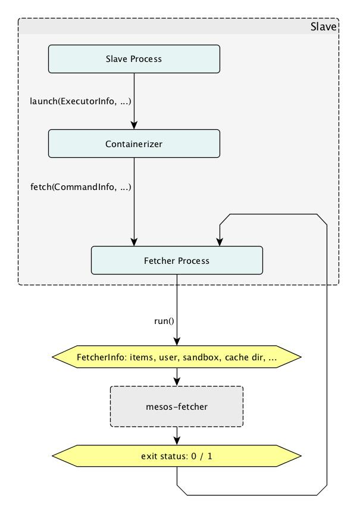
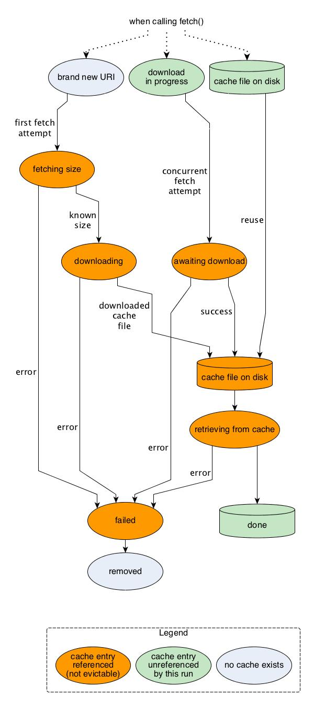
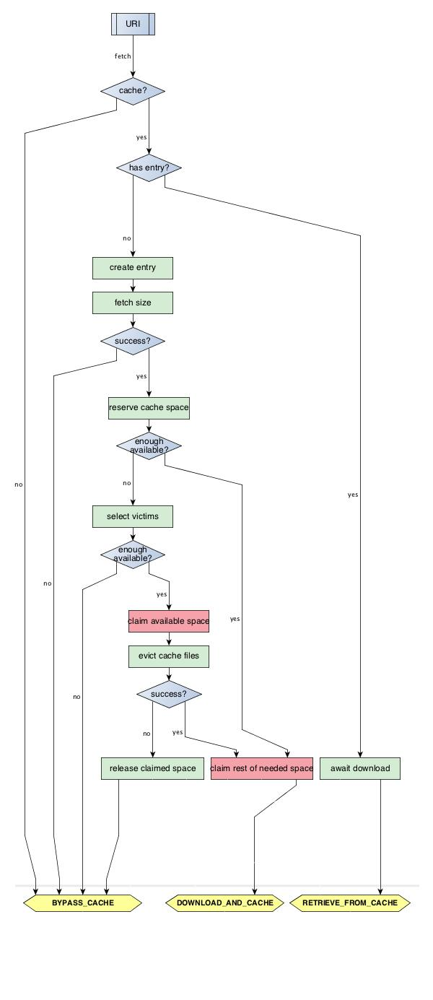
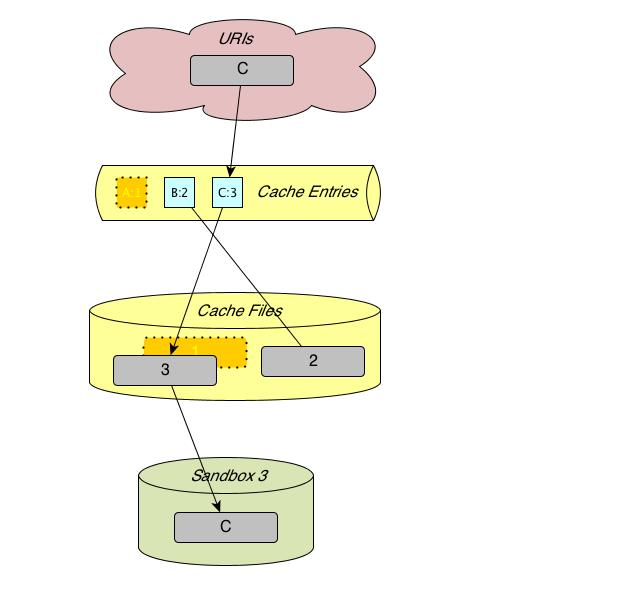
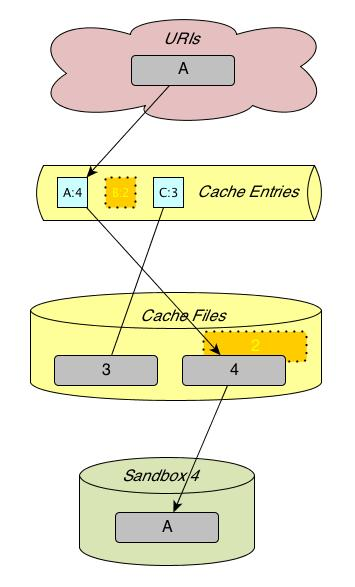

# Mesos Fetcher Cache Internals

It assumed that readers of this document are familiar with the contents of the [Mesos fetcher user guide](fetcher.md). The present document makes direct references to notions defined in the former.

## Design goals for the initial fetcher cache prototype:

0. Direct fetching: Provide the pre-existing fetcher functionality (as in Mesos 0.22 and before) when caching is not explicitly requested.
1. Program isolation: Preserve the approach to employ an external "mesos-fetcher" program to handle all (potentially very lengthy or blocking) content download operations.
2. Cache effect: Significant lessen overall time spent on fetching in case of repetition of requests for the same URI. This holds for both sequential and concurrent repetition. The latter is the case when concurrently launched tasks on the same agent require overlapping URI sets.
3. Cache space limit: Use a user-specified directory for cache storage and maintain a user-specified physical storage space limit for it. Evict older cache files as needed to fetch new cache content.
4. Fallback strategy: Whenever downloading to or from the cache fails for any reason, fetching into the sandbox should still succeed somehow if at all possible.
5. Agent recovery: Support agent recovery.

For future releases, we foresee additional features:

1. Automatic refreshing of cache content when a URI's content has changed.
2. Prefetching URIs for subsequent tasks. Prefetching can run in parallel with task execution.

## How the fetcher cache works

In this section we look deeper into the implementation of design goals #1, #2, #3. The others are sufficiently covered in the user guide.

### Fetcher process and mesos-fetcher

The fetcher mechanism consists of two separate entities:

1. The fetcher process included in the agent program. There is exactly one instance of this per agent.
2. The separate mesos-fetcher program. There is one invocation of this per fetch request from the agent to the fetcher process.

The fetcher process performs internal bookkeeping of what is in the cache and what is not. As needed, it invokes the mesos-fetcher program to download resources from URIs to the cache or directly to sandbox directories, and to copy resources from the cache to a sandbox directory.

All decision making "intelligence" is situated in the fetcher process and the mesos-fetcher program is a rather simple helper program. Except for cache files, there is no persistent state at all in the entire fetcher system. This greatly simplifies dealing with all the inherent intricacies and races involved in concurrent fetching with caching.

The mesos-fetcher program takes straight forward per-URI commands and executes these. It has three possible modes of operation for any given URI:

1. Bypass the cache and fetch directly into the specified sandbox directory.
2. Fetch into the cache and then copy the resulting cache file into the sandbox directory.
3. Do not download anything. Copy (or extract) a resource from the cache into the sandbox directory.

Besides minor complications such as archive extraction and execution rights settings, this already sums up all it does.

Based on this setup, the main program flow in the fetcher process is concerned with assembling a list of parameters to the mesos-fetcher program that describe items to be fetched. This figure illustrates the high-level collaboration of the fetcher process with mesos-fetcher program runs. It also depicts the next level of detail of the fetcher process, which will be described in the following section.

### Cache state representation and manipulation

The fetcher process uses a private instance of class Cache to represent what URIs are cached, where the respective cache files are, what stage of processing they are in, and so on.

The main data structure to hold all this information is a hashmap from URI/user combinations to `Cache::Entry` objects, which each contain information about an individual cache file on disk. These objects are referenced by shared_ptr, because they can be addressed by multiple callbacks on behalf of concurrent fetch attempts while also being held in the hashmap.

A cache entry corresponds directly to a cache file on disk throughout the entire life time of the latter, including before and after its existence. It holds all pertinent state to inform about the phase and results of fetching the corresponding URI.

This figure illustrates the different states which a cache entry can be in.

While a cache entry is referenced it cannot be evicted by the current or any other concurrent fetch attempt in order to make space for a download of a new cache file.

The two blue states are essentially the same: no cache file exists. The two green disk states on the right are also the same.

The figure only depicts what happens from the point of view of one isolated fetch run. Any given cache entry can be referenced simultaniously by another concurrent fetch run. It must not be evicted as long as it is referenced by any fetching activity. We implement this by reference counting. Every cache entry has a reference count field that gets incremented at the beginning of its use by a fetch run and decremented at its end. The latter must happen no matter whether the run has been successful or whether there has been an error. Increments happen when:

- A new cache entry is created. It is immediately referenced.
- An existing cache entry's file download is going to be waited for.
- An existing cache entry has a resident cache file that is going to be retrieved.

Every increment is recorded in a list. At the very end of the fetch procedure, no matter what its outcome is, each entry in the list gets its reference count decremented.

(Currently, we are even leaving reference counts for cache entries for which we fall back to bypassing the cache untouched until the end of the fetch procedure. This may be unnecessary, but it is safe. It is also supposedly rare, because fallbacks only occur to mitigate unexpected error situations. A future version may optimize this behavior.)

### The per-URI control flow

As menitoned above, the fetcher process' main control flow concerns sorting out what to do with each URI presented to it in a fetch request. An overview of the ensuing control flow for a given URI is depicted in this figure.

After going through this procedure for each URI, the fetcher process assembles the gathered list of per-URI actions into a JSON object (`FetcherInfo`), which is passed to the mesos-fetcher program in an environment variable. The possible fetch actions for a URI are shown at the bottom of the flow chart. After they are determined, the fetcher process invokes mesos-fetcher.

The implementation is oriented at this control flow but its code structure cannot match it directly, because some of these branches must span multiple libprocess continuations. There are two layers of futures, one for each of these phases.

  1. Before making fetcher cache items,
    a. Wait for concurrent downloads for pre-existing cache entries.
    b. Wait for size fetching combined and then space reservation for new cache entries.
  2. After making fetcher cache items and running mesos-fetcher,
    a. Complete new cache items with success/failure, which as an important side-effect informs concurrent fetch runs' futures in phase 1/a.

The futures for phase 1 are not shared outside one fetch run. They exclusively guard asynchronous operations for the same fetch run. Their type parameter does not really matter. But each needs to correspond to one URI and eventual fetch item somehow. Multiple variants have been proposed for this. The complexity remains about the same.

The futures for phase 2 need to be part of the cache entries, because they are shared between concurrent fetch runs.

Some time between phase 1 and 2, the fallback strategy needs to be applied where indicated: when a future from phase 1 has failed for any reason, we fall back on bypassing the cache.

Besides, everything touched in 1/a and 1/b needs to be prevented from being cache-evicted until the end. One can in principle release cache entries right after they fail, but this requires more complexity and is harder to prove correct.

### Cache eviction

The resources named "A" and "B" have been fetched with caching into sandbox 1 and 2 below. In the course of this, two cache entries have been created and two files have been downloaded into the cache and named "1" and "2". (Cache file names have unique names that comprise serial numbers.)

The next figure illustrates the state after fetching a different cached URI into sandbox 3, which in this case requires evicting a cache-resident file and its entry. Cache eviction removes cache entries in the order of the least recently used cache entries. Steps if "A" was fetched before "B":

1. Remove the cache entry for "A" from the fetcher process' cache entry table. Its faded depiction is supposed to indicate this. This immediately makes it appear as if the URI has never been cached, even though the cache file is still around.
2. Proceed with fetching "C". This creates a new cache file, which has a different unique name. (The fetcher process remembers in its cache entry which file name belongs to which URI.)

The next figure then shows what happens if the first URI is fetched once again. Here we also assume the cache being so filled up that eviction is necessary and this time the entry and file for "B" are the victims.

