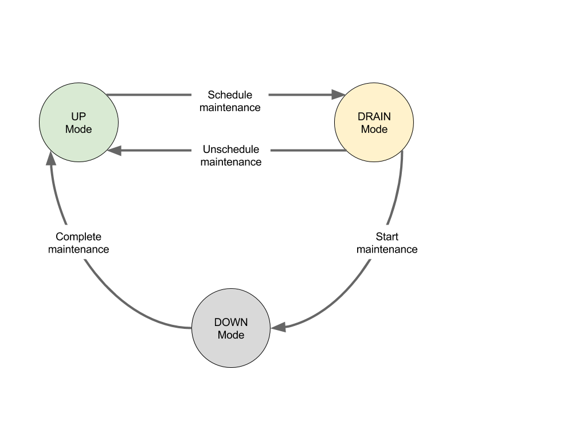

# Maintenance Primitives

Operators regularly need to perform maintenance tasks on machines that comprise
a Mesos cluster.  Most Mesos upgrades can be done without affecting running
tasks, but there are situations where maintenance may affect running tasks.
For example:

* Hardware repair
* Kernel upgrades
* Agent upgrades (e.g., adjusting agent attributes or resources)

Frameworks require visibility into any actions that disrupt cluster operation
in order to meet Service Level Agreements or to ensure uninterrupted services
for their end users.  Therefore, to reconcile the requirements of frameworks
and operators, frameworks must be aware of planned maintenance events and
operators must be aware of frameworks' ability to adapt to maintenance.
Maintenance primitives add a layer to facilitate communication between the
frameworks and operator.

## Terminology

For the purpose of this document, an "Operator" is a person, tool, or script
that manages a Mesos cluster.

Maintenance primitives add several new concepts to Mesos. Those concepts are:

* **Maintenance**: An operation that makes resources on a machine unavailable,
  either temporarily or permanently.
* **Maintenance window**: A set of machines and an associated time interval during
  which some maintenance is planned on those machines.
* **Maintenance schedule**: A list of maintenance windows.
  A single machine may only appear in a schedule once.
* **Unavailability**: An operator-specified interval, defined by a start time
  and duration, during which an associated machine may become unavailable.
  In general, no assumptions should be made about the availability of the
  machine (or resources) after the unavailability.
* **Drain**: An interval between the scheduling of maintenance and when the
  machine(s) become unavailable.  Offers sent with resources from draining
  machines will contain unavailability information.  Frameworks running on
  draining machines will receive inverse offers (see next).  Frameworks
  utilizing resources on affected machines are expected either to take
  preemptive steps to prepare for the unavailability; or to communicate the
  framework's inability to conform to the maintenance schedule.
* **Inverse offer**: A communication mechanism for the master to ask for
  resources back from a framework.  This notifies frameworks about any
  unavailability and gives frameworks a mechanism to respond about their
  ability to comply.  Inverse offers are similar to offers in that they
  can be accepted, declined, re-offered, and rescinded.

**Note**: Unavailability and inverse offers are not specific to maintenance.
The same concepts can be used for non-maintenance goals, such as reallocating
resources or resource preemption.

## How does it work?

Maintenance primitives were introduced in Mesos 0.25.0.  Several machine
maintenance modes were also introduced.  Those modes are illustrated below.



All mode transitions must be initiated by the operator.  Mesos will not
change the mode of any machine, regardless of the estimate provided in
the maintenance schedule.

### Scheduling maintenance

A machine is transitioned from Up mode to Draining mode as soon as it is
scheduled for maintenance.  To transition a machine into Draining mode, an
operator constructs a maintenance schedule as a JSON document and posts it to
the [/maintenance/schedule](endpoints/master/maintenance/schedule.md) HTTP
endpoint on the Mesos master. Each Mesos cluster has a single maintenance
schedule; posting a new schedule replaces the previous schedule, if any.

See the definition of a [maintenance::Schedule](https://github.com/apache/mesos/blob/016b02d7ed5a65bcad9261a133c8237c2df66e6e/include/mesos/maintenance/maintenance.proto#L48-L67)
and of [Unavailability](https://github.com/apache/mesos/blob/016b02d7ed5a65bcad9261a133c8237c2df66e6e/include/mesos/v1/mesos.proto#L140-L154).

In a production environment, the schedule should be constructed to ensure that
enough agents are operational at any given point in time to ensure
uninterrupted service by the frameworks.

For example, in a cluster of three machines, the operator might schedule two
machines for one hour of maintenance, followed by another hour for the last
machine.  The timestamps for unavailability are expressed in nanoseconds since
the Unix epoch (note that making reliable use of maintenance primitives requires
that the system clocks of all machines in the cluster are roughly synchronized).

The schedule might look like:

```
{
  "windows" : [
    {
      "machine_ids" : [
        { "hostname" : "machine1", "ip" : "10.0.0.1" },
        { "hostname" : "machine2", "ip" : "10.0.0.2" }
      ],
      "unavailability" : {
        "start" : { "nanoseconds" : 1443830400000000000 },
        "duration" : { "nanoseconds" : 3600000000000 }
      }
    }, {
      "machine_ids" : [
        { "hostname" : "machine3", "ip" : "10.0.0.3" }
      ],
      "unavailability" : {
        "start" : { "nanoseconds" : 1443834000000000000 },
        "duration" : { "nanoseconds" : 3600000000000 }
      }
    }
  ]
}
```

The operator can then post the schedule to the master's
[/maintenance/schedule](endpoints/master/maintenance/schedule.md) endpoint:

```
curl http://localhost:5050/maintenance/schedule \
  -H "Content-type: application/json" \
  -X POST \
  -d @schedule.json
```

The machines in a maintenance schedule do not need to be registered with the
Mesos master at the time when the schedule is set.  The operator may add a
machine to the maintenance schedule prior to launching an agent on the machine.
For example, this can be useful to prevent a faulty machine from launching an
agent on boot.

**Note**: Each machine in the maintenance schedule should have as
complete information as possible.  In order for Mesos to recognize an agent
as coming from a particular machine, both the `hostname` and `ip` fields must
match.  Any omitted data defaults to the empty string `""`.  If there are
multiple hostnames or IPs for a machine, the machine's fields need to match
what the agent announces to the master.  If there is any ambiguity in a
machine's configuration, the operator should use the `--hostname` and `--ip`
options when starting agents.

The master checks that a maintenance schedule has the following properties:

* Each maintenance window in the schedule must have at least one machine
  and a specified unavailability interval.
* Each machine must only appear in the schedule once.
* Each machine must have at least a hostname or IP included.
  The hostname is not case-sensitive.
* All machines that are in Down mode must be present in the schedule.
  This is required because this endpoint does not handle the transition
  from Down mode to Up mode.

If any of these properties are not met, the maintenance schedule is rejected
with a corresponding error message and the master's state is not changed.

To update the maintenance schedule, the operator should first read the current
schedule, make any necessary changes, and then post the modified schedule. The
current maintenance schedule can be obtained by sending a GET request to the
master's `/maintenance/schedule` endpoint.

To cancel the maintenance schedule, the operator should post an empty schedule.

### Draining mode

As soon as a schedule is posted to the Mesos master, the following things occur:

* The schedule is stored in the [replicated log](replicated-log-internals.md).
  This means the schedule is persisted in case of master failover.
* All machines in the schedule are immediately transitioned into Draining
  mode.  The mode of each machine is also persisted in the replicated log.
* All frameworks using resources on affected agents are immediately
  notified.  Existing offers from the affected agents are rescinded
  and re-sent with additional unavailability data.  All frameworks using
  resources from the affected agents are given inverse offers.
* New offers from the affected agents will also include
  the additional unavailability data.

Frameworks should use this additional information to schedule tasks in a
maintenance-aware fashion. Exactly how to do this depends on the design
requirements of each scheduler, but tasks should typically be scheduled in a way
that maximizes utilization but that also attempts to vacate machines before that
machine's advertised unavailability period occurs. A scheduler might choose to
place long-running tasks on machines with no unavailability, or failing that, on
machines whose unavailability is the furthest away.

How a framework responds to an inverse offer indicates its ability to conform to
the maintenance schedule. Accepting an inverse offer communicates that the
framework is okay with the current maintenance schedule, given the current state
of the framework's resources.  The master and operator should interpret
acceptance as a best-effort promise by the framework to free all the resources
contained in the inverse offer before the start of the unavailability
interval. Declining an inverse offer is an advisory notice to the operator that
the framework is unable or unlikely to meet to the maintenance schedule.

For example:

* A data store may choose to start a new replica if one of its agents is
  scheduled for maintenance. The data store should accept an inverse offer if it
  can reasonably copy the data on the machine to a new host before the
  unavailability interval described in the inverse offer begins. Otherwise, the
  data store should decline the offer.
* A stateful task on an agent with an impending unavailability may be migrated
  to another available agent.  If the framework has sufficient resources to do
  so, it would accept any inverse offers.  Otherwise, it would decline them.

A framework can use a filter to control when it wants to be contacted again
with an inverse offer.  This is useful since future circumstances may change
the viability of the maintenance schedule.  The filter for inverse offers is
identical to the existing mechanism for re-offering offers to frameworks.

**Note**: Accepting or declining an inverse offer does not result in
immediate changes in the maintenance schedule or in the way Mesos acts.
Inverse offers only represent extra information that frameworks may
find useful. In the same manner, rejecting or accepting an inverse offer is a
hint for an operator. The operator may or may not choose to take that hint
into account.

### Starting maintenance

The operator starts maintenance by posting a list of machines to the
[/machine/down](endpoints/master/machine/down.md) HTTP endpoint. The list of
machines is specified in JSON format; each element of the list is a
[MachineID](https://github.com/apache/mesos/blob/016b02d7ed5a65bcad9261a133c8237c2df66e6e/include/mesos/v1/mesos.proto#L157-L167).

For example, to start maintenance on two machines:

```
[
  { "hostname" : "machine1", "ip" : "10.0.0.1" },
  { "hostname" : "machine2", "ip" : "10.0.0.2" }
]
```

```
curl http://localhost:5050/machine/down \
  -H "Content-type: application/json" \
  -X POST \
  -d @machines.json
```

The master checks that a list of machines has the following properties:

* The list of machines must not be empty.
* Each machine must only appear once.
* Each machine must have at least a hostname or IP included.
  The hostname is not case-sensitive.
* If a machine's IP is included, it must be correctly formed.
* All listed machines must be present in the schedule.

If any of these properties are not met, the operation is rejected with a
corresponding error message and the master's state is not changed.

The operator can start maintenance on any machine that is scheduled for
maintenance. Machines that are not scheduled for maintenance cannot be directly
transitioned from Up mode into Down mode.  However, the operator may schedule a
machine for maintenance with a timestamp equal to the current time or in the
past, and then immediately start maintenance on that machine.

This endpoint can be used to start maintenance on machines that are not
currently registered with the Mesos master. This can be useful if a machine has
failed and the operator intends to remove it from the cluster; starting
maintenance on the machine prevents the machine from being accidentally rebooted
and rejoining the Mesos cluster.

The operator must explicitly transition a machine from Draining to Down
mode. That is, Mesos will keep a machine in Draining mode even if the
unavailability window arrives or passes.  This means that the operation of the
machine is not disrupted in any way and offers (with unavailability information)
are still sent for this machine.

When maintenance is triggered by the operator, all agents on the machine are
told to shutdown.  These agents are removed from the master, which means that a
`TASK_LOST` status update will be sent for every task running on each of those
agents. The scheduler driver's `slaveLost` callback will also be invoked for
each of the removed agents. Any agents on machines in maintenance are also
prevented from reregistering with the master in the future (until maintenance
is completed and the machine is brought back up).

### Completing maintenance

When maintenance is complete or if maintenance needs to be cancelled,
the operator can stop maintenance.  The process is very similar
to starting maintenance (same validation criteria as the previous section).
The operator posts a list of machines to the master's [/machine/up](endpoints/master/machine/up.md) endpoint:

```
[
  { "hostname" : "machine1", "ip" : "10.0.0.1" },
  { "hostname" : "machine2", "ip" : "10.0.0.2" }
]
```

```
curl http://localhost:5050/machine/up \
  -H "Content-type: application/json" \
  -X POST \
  -d @machines.json
```

**Note**: The duration of the maintenance window, as indicated by the
"unavailability" field in the maintenance schedule, is a best-effort guess made
by the operator.  Stopping maintenance before the end of the unavailability
interval is allowed, as is stopping maintenance after the end of the
unavailability interval.  Machines are never automatically transitioned out of
maintenance.

Frameworks are informed about the completion or cancellation of maintenance when
offers from that machine start being sent.  There is no explicit mechanism for
notifying frameworks when maintenance has finished.  After maintenance has
finished, new offers are no longer tagged with unavailability and inverse offers
are no longer sent.  Also, agents running on the machine will be allowed to
register with the Mesos master.

### Viewing maintenance status

The current maintenance status (Up, Draining, or Down) of each machine in the
cluster can be viewed by accessing the master's
[/maintenance/status](endpoints/master/maintenance/status.md) HTTP endpoint. For
each machine that is Draining, this endpoint also includes the frameworks' responses to
inverse offers for resources on that machine. For more information, see the
format of the [ClusterStatus message](https://github.com/apache/mesos/blob/fa36917dd142f66924c5f7ed689b87d5ceabbf79/include/mesos/maintenance/maintenance.proto#L73-L84).

>NOTE: The format of the data returned by this endpoint may change in a
future release of Mesos.
