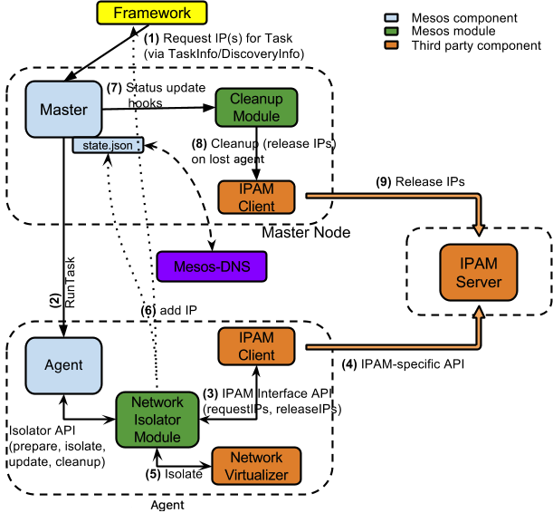

# Networking for Mesos-Managed Containers

While networking plays a key role in data center infrastructure, it is -- for
now -- beyond the scope of Mesos to try to address the concerns of networking
setup, topology and performance. However, Mesos can ease integrations with
existing networking solutions and enable features, like IP per container,
task-granular task isolation and service discovery. More often than not, it
will be challenging to provide a one-size-fits-all networking solution. The
requirements and available solutions will vary across all cloud-only,
on-premise, and hybrid deployments.

One of the primary goals for the networking support in Mesos was to have a
pluggable mechanism to allow users to enable custom networking solution as
needed. As a result, several extensions were added to Mesos components in
version 0.25.0 to enable networking support. Further, all the extensions are
opt-in to allow older frameworks and applications without networking support to
coexist with the newer ones.

The rest of this document describes the overall architecture of all the involved
components, configuration steps for enabling IP-per-container, and required
framework changes.

## How does it work?




A key observation is that the networking support is enabled via a Mesos module
and thus the Mesos master and agents are completely oblivious of it. It is
completely up to the networking module to provide the desired support. Next,
the IP requests are provided on a best effort manner. Thus, the framework should
be willing to handle ignored (in cases where the module(s) are not present) or
declined (the IPs can't be assigned due to various reasons) requests.

To maximize backwards-compatibility with existing frameworks, schedulers must
opt-in to network isolation per-container. Schedulers opt in to network
isolation using new data structures in the TaskInfo message.

### Terminology

* IP Address Management (IPAM) Server
  * assigns IPs on demand
  * recycles IPs once they have been released
  * (optionally) can tag IPs with a given string/id.

* IPAM client
  * tightly coupled with a particular IPAM server
  * acts as a bridge between the "Network Isolator Module" and the IPAM server
  * communicates with the server to request/release IPs

* Network Isolator Module (NIM):
  * a Mesos module for the Agent implementing the `Isolator` interface
  * looks at TaskInfos to detect the IP requirements for the tasks
  * communicates with the IPAM client to request/release IPs
  * communicates with an external network virtualizer/isolator to enable network
    isolation

* Cleanup Module:
  * responsible for doing a cleanup (releasing IPs, etc.) during an Agent lost
    event, dormant otherwise

### Framework requests IP address for containers

1. A Mesos framework uses the TaskInfo message to requests IPs for each
   container being launched. (The request is ignored if the Mesos cluster
   doesn't have support for IP-per-container.)

2. Mesos Master processes TaskInfos and forwards them to the Agent for launching
   tasks.

### Network isolator module gets IP from IPAM server

3. Mesos Agent inspects the TaskInfo to detect the container requirements
   (MesosContainerizer in this case) and prepares various Isolators for the
   to-be-launched container.
   * The NIM inspects the TaskInfo to decide whether to enable network isolator
     or not.

4. If network isolator is to be enabled, NIM requests IP address(es) via IPAM
     client and informs the Agent.

### Agent launches container with a network namespace

5. The Agent launches a container within a new network namespace.
   * The Agent calls into NIM to perform "isolation"
   * The NIM then calls into network virtualizer to isolate the container.

### Network virtualizer assigns IP address to the container and isolates it.

6. NIM then "decorates" the TaskStatus with the IP information.
   * The IP address(es) from TaskStatus are made available at Master's
     [/state](endpoints/master/state.md) endpoint.
   * The TaskStatus is also forwarded to the framework to inform it of the IP
     addresses.
   * When a task is killed or lost, NIM communicates with IPAM client to release
     corresponding IP address(es).

### Cleanup module detects lost Agents and performs cleanup

7. The cleanup module gets notified if there is an Agent-lost event.

8. The cleanup module communicates with the IPAM client to release all IP
   address(es) associated with the lost Agent. The IPAM may have a grace period
   before the address(es) are recycled.

## Configuration

The network isolator module is not part of standard Mesos distribution. However,
there is an example implementation at https://github.com/mesosphere/net-modules.

Once the network isolation module has been built into a shared dynamic library,
we can load it into Mesos Agent (see [modules documentation](modules.md) on
instructions for building and loading a module).

## Enabling frameworks for IP-per-container capability

### NetworkInfo

A new NetworkInfo message has been introduced:

```{.proto}
message NetworkInfo {
  enum Protocol {
    IPv4 = 1;
    IPv6 = 2;
  }

  message IPAddress {
    optional Protocol protocol = 1;

    optional string ip_address = 2;
  }

  repeated IPAddress ip_addresses = 5;

  optional string name = 6;

  optional Protocol protocol = 1 [deprecated = true]; // Since 0.26.0

  optional string ip_address = 2 [deprecated = true]; // Since 0.26.0

  repeated string groups = 3;

  optional Labels labels = 4;
};
```

When requesting an IP address from the IPAM, one needs to set the `protocol`
field to `IPv4` or `IPv6`. Setting `ip_address` to a valid IP address allows the
framework to specify a static IP address for the container (if supported by the
NIM). This is helpful in situations where a task must be bound to a particular
IP address even as it is killed and restarted on a different node.

Setting `name` to a valid network name allows the framework to specify a network
for the container to join, it is up to the network isolator to decide how to
interpret this field, e.g., `network/cni` isolator will interpret it as the name
of a CNI network.


### Examples of specifying network requirements

Frameworks wanting to enable IP per container, need to provide `NetworkInfo`
message in TaskInfo. Here are a few examples:

1. A request for one address of unspecified protocol version using the default
   command executor


   ```
   TaskInfo {
     ...
     command: ...,
     container: ContainerInfo {
       network_infos: [
         NetworkInfo {
           ip_addresses: [
             IPAddress {
               protocol: None;
               ip_address: None;
             }
           ]
           groups: [];
           labels: None;
         }
       ]
     }
   }
   ```

2. A request for one IPv4 and one IPv6 address, in two groups using the
   default command executor


   ```
   TaskInfo {
     ...
     command: ...,
     container: ContainerInfo {
       network_infos: [
         NetworkInfo {
           ip_addresses: [
             IPAddress {
               protocol: IPv4;
               ip_address: None;
             },
             IPAddress {
               protocol: IPv6;
               ip_address: None;
             }
           ]
           groups: ["dev", "test"];
           labels: None;
         }
       ]
     }
   }
   ```

3. A request for two network interfaces, each with one IP address, each in
   a different network group using the default command executor


   ```
   TaskInfo {
     ...
     command: ...,
     container: ContainerInfo {
       network_infos: [
         NetworkInfo {
           ip_addresses: [
             IPAddress {
               protocol: None;
               ip_address: None;
             }
           ]
           groups: ["foo"];
           labels: None;
         },
         NetworkInfo {
           ip_addresses: [
             IPAddress {
               protocol: None;
               ip_address: None;
             }
           ]
           groups: ["bar"];
           labels: None;
         },
       ]
     }
   }
   ```

4. A request for a specific IP address using a custom executor

   ```
   TaskInfo {
     ...
     executor: ExecutorInfo {
       ...,
       container: ContainerInfo {
         network_infos: [
           NetworkInfo {
             ip_addresses: [
               IPAddress {
                 protocol: None;
                 ip_address: "10.1.2.3";
               }
             ]
             groups: [];
             labels: None;
           }
         ]
       }
     }
   }
   ```

5. A request for joining a specific network using the default command executor

   ```
   TaskInfo {
     ...
     command: ...,
     container: ContainerInfo {
       network_infos: [
         NetworkInfo {
           name: "network1";
         }
       ]
     }
   }
   ```

NOTE: The Mesos Containerizer will reject any CommandInfo that has a
ContainerInfo. For this reason, when opting in to network isolation when
using the Mesos Containerizer, set TaskInfo.ContainerInfo.NetworkInfo.

## Address Discovery

The NetworkInfo message allows frameworks to request IP address(es) to be
assigned at task launch time on the Mesos agent. After opting in to network
isolation for a given executor's container in this way, frameworks will need to
know what address(es) were ultimately assigned in order to perform health
checks, or any other out-of-band communication.

This is accomplished by adding a new field to the TaskStatus message.

```{.proto}
message ContainerStatus {
   repeated NetworkInfo network_infos;
}

message TaskStatus {
  ...
  optional ContainerStatus container;
  ...
};
```

Further, the container IP addresses are also exposed via Master's state
endpoint. The JSON output from Master's state endpoint contains a list of task
statuses. If a task's container was started with it's own IP address, the
assigned IP address will be exposed as part of the `TASK_RUNNING` status.

NOTE: Since per-container address(es) are strictly opt-in from the framework,
the framework may ignore the IP address(es) provided in StatusUpdate if it
didn't set NetworkInfo in the first place.

## Writing a Custom Network Isolator Module

A network isolator module implements the Isolator interface provided by Mesos.
The module is loaded as a dynamic shared library in to the Mesos Agent and gets
hooked up in the container launch sequence. A network isolator may communicate
with external IPAM and network virtualizer tools to fulfill framework
requirements.

In terms of the Isolator API, there are three key callbacks that a network
isolator module should implement:

1. `Isolator::prepare()` provides the module with a chance to decide whether or
   not the enable network isolation for the given task container. If the network
   isolation is to be enabled, the Isolator::prepare call would inform the Agent
   to create a private network namespace for the coordinator. It is this
   interface, that will also generate an IP address (statically or with the help
   of an external IPAM agent) for the container.

2. `Isolator::isolate()` provide the module with the opportunity to _isolate_
   the container _after_ it has been created but before the executor is launched
   inside the container. This would involve creating virtual ethernet adapter
   for the container and assigning it an IP address. The module can also use
   help of an external network virtualizer/isolator for setting up network for
   the container.

3. `Isolator::cleanup()` is called when the container terminates. This allows the
   module to perform any cleanups such as recovering resources and releasing IP
   addresses as needed.
