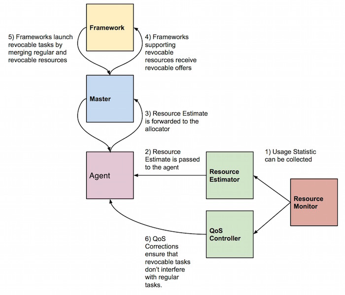

# Oversubscription

High-priority user-facing services are typically provisioned on large clusters
for peak load and unexpected load spikes. Hence, for most of time, the
provisioned resources remain underutilized. Oversubscription takes advantage of
temporarily unused resources to execute best-effort tasks such as background
analytics, video/image processing, chip simulations, and other low priority
jobs.

## How does it work?

Oversubscription was introduced in Mesos 0.23.0 and adds two new agent
components: a Resource Estimator and a Quality of Service (QoS) Controller,
alongside extending the existing resource allocator, resource monitor, and
Mesos agent. The new components and their interactions are illustrated below.



### Resource estimation

 - (1) The first step is to identify the amount of oversubscribed resources.
   The resource estimator taps into the resource monitor and periodically gets
usage statistics via `ResourceStatistic` messages. The resource estimator
applies logic based on the collected resource statistics to determine the
amount of oversubscribed resources. This can be a series of control algorithms
based on measured resource usage slack (allocated but unused resources) and
allocation slack.

 - (2) The agent keeps polling estimates from the resource estimator and tracks
   the latest estimate.

 - (3) The agent will send the total amount of oversubscribed resources to the
   master when the latest estimate is different from the previous estimate.

### Resource tracking & scheduling algorithm

 - (4) The allocator keeps track of the oversubscribed resources separately
   from regular resources and annotate those resources as `revocable`. It is up
to the resource estimator to determine which types of resources can be
oversubscribed. It is recommended only to oversubscribe _compressible_
resources such as cpu shares, bandwidth, etc.

### Frameworks

 - (5) Frameworks can choose to launch tasks on revocable resources by using
   the regular `launchTasks()` API. To safe-guard frameworks that are not
designed to deal with preemption, only frameworks registering with the
`REVOCABLE_RESOURCES` capability set in its framework info will receive offers
with revocable resources.  Further more, revocable resources cannot be
dynamically reserved and persistent volumes should not be created on revocable
disk resources.

### Task launch

 - The revocable task is launched as usual when the `runTask` request is received
   on the agent. The resources will still be marked as revocable and isolators
can take appropriate actions, if certain resources need to be setup differently
for revocable and regular tasks.

> NOTE: If any resource used by a task or executor is
revocable, the whole container is treated as a revocable container and can
therefore be killed or throttled by the QoS Controller.

### Interference detection

 - (6) When the revocable task is running, it is important to constantly
   monitor the original task running on those resources and guarantee
performance based on an SLA.  In order to react to detected interference, the
QoS controller needs to be able to kill or throttle running revocable tasks.

## Enabling frameworks to use oversubscribed resources

Frameworks planning to use oversubscribed resources need to register with the
`REVOCABLE_RESOURCES` capability set:

~~~{.cpp}
FrameworkInfo framework;
framework.set_name("Revocable framework");

framework.add_capabilities()->set_type(
    FrameworkInfo::Capability::REVOCABLE_RESOURCES);
~~~

From that point on, the framework will start to receive revocable resources in
offers.

> NOTE: That there is no guarantee that the Mesos cluster has oversubscription
enabled. If not, no revocable resources will be offered. See below for
instructions how to configure Mesos for oversubscription.

### Launching tasks using revocable resources

Launching tasks using revocable resources is done through the existing
`launchTasks` API. Revocable resources will have the `revocable` field set. See
below for an example offer with regular and revocable resources.

~~~{.json}
{
  "id": "20150618-112946-201330860-5050-2210-0000",
  "framework_id": "20141119-101031-201330860-5050-3757-0000",
  "agent_id": "20150618-112946-201330860-5050-2210-S1",
  "hostname": "foobar",
  "resources": [
    {
      "name": "cpus",
      "type": "SCALAR",
      "scalar": {
        "value": 2.0
      },
      "role": "*"
    }, {
      "name": "mem",
      "type": "SCALAR",
      "scalar": {
        "value": 512.0
      },
      "role": "*"
    },
    {
      "name": "cpus",
      "type": "SCALAR",
      "scalar": {
        "value": 0.45
      },
      "role": "*",
      "revocable": {}
    }
  ]
}
~~~

## Writing a custom resource estimator

The resource estimator estimates and predicts the total resources used on the
agent and informs the master about resources that can be oversubscribed. By
default, Mesos comes with a `noop` and a `fixed` resource estimator. The `noop`
estimator only provides an empty estimate to the agent and stalls, effectively
disabling oversubscription. The `fixed` estimator doesn't use the actual
measured slack, but oversubscribes the node with fixed resource amount (defined
via a command line flag).

The interface is defined below:

~~~{.cpp}
class ResourceEstimator
{
public:
  // Initializes this resource estimator. This method needs to be
  // called before any other member method is called. It registers
  // a callback in the resource estimator. The callback allows the
  // resource estimator to fetch the current resource usage for each
  // executor on agent.
  virtual Try<Nothing> initialize(
      const lambda::function<process::Future<ResourceUsage>()>& usage) = 0;

  // Returns the current estimation about the *maximum* amount of
  // resources that can be oversubscribed on the agent. A new
  // estimation will invalidate all the previously returned
  // estimations. The agent will be calling this method periodically
  // to forward it to the master. As a result, the estimator should
  // respond with an estimate every time this method is called.
  virtual process::Future<Resources> oversubscribable() = 0;
};
~~~

## Writing a custom QoS controller

The interface for implementing custom QoS Controllers is defined below:

~~~{.cpp}
class QoSController
{
public:
  // Initializes this QoS Controller. This method needs to be
  // called before any other member method is called. It registers
  // a callback in the QoS Controller. The callback allows the
  // QoS Controller to fetch the current resource usage for each
  // executor on agent.
  virtual Try<Nothing> initialize(
      const lambda::function<process::Future<ResourceUsage>()>& usage) = 0;

  // A QoS Controller informs the agent about corrections to carry
  // out, but returning futures to QoSCorrection objects. For more
  // information, please refer to mesos.proto.
  virtual process::Future<std::list<QoSCorrection>> corrections() = 0;
};
~~~

> NOTE The QoS Controller must not block `corrections()`. Back the QoS
> Controller with its own libprocess actor instead.

The QoS Controller informs the agent that particular corrective actions need to
be made. Each corrective action contains information about executor or task and
the type of action to perform.

Mesos comes with a `noop` and a `load` qos controller. The `noop` controller
does not provide any corrections, thus does not assure any quality of service
for regular tasks. The `load` controller is ensuring the total system load
doesn't exceed a configurable thresholds and as a result try to avoid the cpu
congestion on the node. If the load is above the thresholds controller evicts
all the revocable executors. These thresholds are configurable via two module
parameters `load_threshold_5min` and `load_threshold_15min`. They represent
standard unix load averages in the system. 1 minute system load is ignored,
since for oversubscription use case it can be a misleading signal.

~~~{.proto}
message QoSCorrection {
  enum Type {
    KILL = 1; // Terminate an executor.
  }

  message Kill {
    optional FrameworkID framework_id = 1;
    optional ExecutorID executor_id = 2;
  }

  required Type type = 1;
  optional Kill kill = 2;
}
~~~

## Configuring oversubscription

Five new flags has been added to the agent:

<table class="table table-striped">
  <thead>
    <tr>
      <th width="30%">
        Flag
      </th>
      <th>
        Explanation
      </th>
  </thead>

  <tr>
    <td>
      --oversubscribed_resources_interval=VALUE
    </td>
    <td>
      The agent periodically updates the master with the current estimation
about the total amount of oversubscribed resources that are allocated and
available. The interval between updates is controlled by this flag. (default:
15secs)
    </td>
  </tr>

  <tr>
    <td>
      --qos_controller=VALUE
    </td>
    <td>
      The name of the QoS Controller to use for oversubscription.
    </td>
  </tr>

  <tr>
    <td>
      --qos_correction_interval_min=VALUE
    </td>
    <td>
      The agent polls and carries out QoS corrections from the QoS Controller
based on its observed performance of running tasks. The smallest interval
between these corrections is controlled by this flag. (default: 0ns)
    </td>
  </tr>

  <tr>
    <td>
      --resource_estimator=VALUE
    </td>
    <td>
      The name of the resource estimator to use for oversubscription.
    </td>
  </tr>

</table>

The `fixed` resource estimator is enabled as follows:

```
--resource_estimator="org_apache_mesos_FixedResourceEstimator"

--modules='{
  "libraries": {
    "file": "/usr/local/lib64/libfixed_resource_estimator.so",
    "modules": {
      "name": "org_apache_mesos_FixedResourceEstimator",
      "parameters": {
        "key": "resources",
        "value": "cpus:14"
      }
    }
  }
}'
```

In the example above, a fixed amount of 14 cpus will be offered as revocable
resources.

The `load` qos controller is enabled as follows:

```
--qos_controller="org_apache_mesos_LoadQoSController"

--qos_correction_interval_min="20secs"

--modules='{
  "libraries": {
    "file": "/usr/local/lib64/libload_qos_controller.so",
    "modules": {
      "name": "org_apache_mesos_LoadQoSController",
      "parameters": [
        {
          "key": "load_threshold_5min",
          "value": "6"
        },
        {
	  "key": "load_threshold_15min",
	  "value": "4"
        }
      ]
    }
  }
}'
```

In the example above, when standard unix system load average for 5 minutes will
be above 6, or for 15 minutes will be above 4 then agent will evict all the
`revocable` executors. `LoadQoSController` will be effectively run every 20
seconds.

To install a custom resource estimator and QoS controller, please refer to the
[modules documentation](modules.md).
