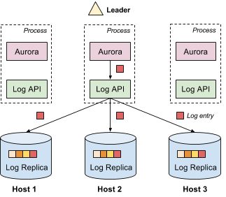
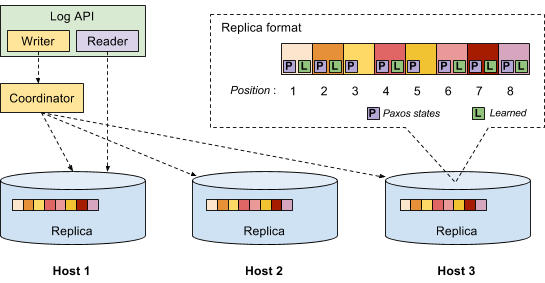

# The Mesos Replicated Log

Mesos provides a library that lets you create replicated fault-tolerant append-only logs; this library is known as the _replicated log_. The Mesos master uses this library to store cluster state in a replicated, durable way; the library is also available for use by frameworks to store replicated framework state or to implement the common "[replicated state machine](https://en.wikipedia.org/wiki/State_machine_replication)" pattern.

## What is the replicated log?

The replicated log provides _append-only_ storage of _log entries_; each log entry can contain arbitrary data. The log is _replicated_, which means that each log entry has multiple copies in the system. Replication provides both fault tolerance and high availability. In the following example, we use [Apache Aurora](https://aurora.apache.org/), a fault tolerant scheduler (i.e., framework) running on top of Mesos, to show a typical replicated log setup.

As shown above, there are multiple Aurora instances running simultaneously (for high availability), with one elected as the leader. There is a log replica on each host running Aurora. Aurora can access the replicated log through a thin library containing the log API.

Typically, the leader is the only one that appends data to the log. Each log entry is replicated and sent to all replicas in the system. Replicas are strongly consistent. In other words, all replicas agree on the value of each log entry. Because the log is replicated, when Aurora decides to failover, it does not need to copy the log from a remote host.

## Use Cases

The replicated log can be used to build a wide variety of distributed applications. For example, Aurora uses the replicated log to store all task states and job configurations. The Mesos master's _registry_ also leverages the replicated log to store information about all agents in the cluster.

The replicated log is often used to allow applications to manage replicated state in a strongly consistent way. One way to do this is to store a state-mutating operation in each log entry and have all instances of the distributed application agree on the same initial state (e.g., empty state). The replicated log ensures that each application instance will observe the same sequence of log entries in the same order; as long as applying a state-mutating operation is deterministic, this ensures that all application instances will remain consistent with one another. If any instance of the application crashes, it can reconstruct the current version of the replicated state by starting at the initial state and re-applying all the logged mutations in order.

If the log grows too large, an application can write out a snapshot and then delete all the log entries that occurred before the snapshot. Using this approach, we will be exposing a [distributed state](https://github.com/apache/mesos/blob/master/src/state/state.hpp) abstraction in Mesos with replicated log as a backend.

Similarly, the replicated log can be used to build [replicated state machines](https://en.wikipedia.org/wiki/State_machine_replication). In this scenario, each log entry contains a state machine command. Since replicas are strongly consistent, all servers will execute the same commands in the same order.

## Implementation

The replicated log uses the [Paxos consensus algorithm](https://en.wikipedia.org/wiki/Paxos_%28computer_science%29) to ensure that all replicas agree on every log entry's value. It is similar to what's described in [these slides](https://ramcloud.stanford.edu/~ongaro/userstudy/paxos.pdf). Readers who are familiar with Paxos can skip this section.

The above figure is an implementation overview. When a user wants to append data to the log, the system creates a log writer. The log writer internally creates a coordinator. The coordinator contacts all replicas and executes the Paxos algorithm to make sure all replicas agree about the appended data. The coordinator is sometimes referred to as the [_proposer_](https://en.wikipedia.org/wiki/Paxos_%28computer_science%29).

Each replica keeps an array of log entries. The array index is the log position. Each log entry is composed of three components: the value written by the user, the associated Paxos state and a _learned_ bit where true means this log entry's value has been agreed. Therefore, a replica in our implementation is both an [_acceptor_](https://en.wikipedia.org/wiki/Paxos_%28computer_science%29) and a [_learner_](https://en.wikipedia.org/wiki/Paxos_%28computer_science%29).

### Reaching consensus for a single log entry

A Paxos round can help all replicas reach consensus on a single log entry's value. It has two phases: a promise phase and a write phase. Note that we are using slightly different terminology from the [original Paxos paper](https://research.microsoft.com/en-us/um/people/lamport/pubs/paxos-simple.pdf). In our implementation, the _prepare_ and _accept_ phases in the original paper are referred to as the _promise_ and _write_ phases, respectively. Consequently, a prepare request (response) is referred to as a promise request (response), and an accept request (response) is referred to as a write request (response).

To append value _X_ to the log at position _p_, the coordinator first broadcasts a promise request to all replicas with proposal number _n_, asking replicas to promise that they will not respond to any request (promise/write request) with a proposal number lower than _n_. We assume that _n_ is higher than any other previously used proposal number, and will explain how we do this later.

When receiving the promise request, each replica checks its Paxos state to decide if it can safely respond to the request, depending on the promises it has previously given out. If the replica is able to give the promise (i.e., passes the proposal number check), it will first persist its promise (the proposal number _n_) on disk and reply with a promise response. If the replica has been previously written (i.e., accepted a write request), it needs to include the previously written value along with the proposal number used in that write request into the promise response it's about to send out.

Upon receiving promise responses from a [quorum](https://en.wikipedia.org/wiki/Quorum_%28distributed_computing%29) of replicas, the coordinator first checks if there exist any previously written value from those responses. The append operation cannot continue if a previously written value is found because it's likely that a value has already been agreed on for that log entry. This is one of the key ideas in Paxos: restrict the value that can be written to ensure consistency.

If no previous written value is found, the coordinator broadcasts a write request to all replicas with value _X_ and proposal number _n_. On receiving the write request, each replica checks the promise it has given again, and replies with a write response if the write request's proposal number is equal to or larger than the proposal number it has promised. Once the coordinator receives write responses from a quorum of replicas, the append operation succeeds.

### Optimizing append latency using Multi-Paxos

One naive solution to implement a replicated log is to run a full Paxos round (promise phase and write phase) for each log entry. As discussed in the [original Paxos paper](https://research.microsoft.com/en-us/um/people/lamport/pubs/paxos-simple.pdf), if the leader is relatively stable, _Multi-Paxos_ can be used to eliminate the need for the promise phase for most of the append operations, resulting in improved performance.

To do that, we introduce a new type of promise request called an _implicit_ promise request. An implicit promise request can be viewed as a _batched_ promise request for a (potentially infinite) set of log entries. Broadcasting an implicit promise request is conceptually equivalent to broadcasting a promise request for every log entry whose value has not yet been agreed. If the implicit promise request broadcasted by a coordinator gets accepted by a quorum of replicas, this coordinator is no longer required to run the promise phase if it wants to append to a log entry whose value has not yet been agreed because the promise phase has already been done in _batch_. The coordinator in this case is therefore called _elected_ (a.k.a., the leader), and has _exclusive_ access to the replicated log. An elected coordinator may be _demoted_ (or lose exclusive access) if another coordinator broadcasts an implicit promise request with a higher proposal number.

One question remaining is how can we find out those log entries whose values have not yet been agreed. We have a very simple solution: if a replica accepts an implicit promise request, it will include its largest known log position in the response. An elected coordinator will only append log entries at positions larger than _p_, where _p_ is greater than any log position seen in these responses.

Multi-Paxos has better performance if the leader is stable. The replicated log itself does not perform leader election. Instead, we rely on the user of the replicated log to choose a stable leader. For example, Aurora uses [ZooKeeper](https://zookeeper.apache.org/) to elect the leader.

### Enabling local reads

As discussed above, in our implementation, each replica is both an acceptor and a learner. Treating each replica as a learner allows us to do local reads without involving other replicas. When a log entry's value has been agreed, the coordinator will broadcast a _learned_ message to all replicas. Once a replica receives the learned message, it will set the learned bit in the corresponding log entry, indicating the value of that log entry has been agreed. We say a log entry is "learned" if its learned bit is set. The coordinator does not have to wait for replicas' acknowledgments.

To perform a read, the log reader will directly look up the underlying local replica. If the corresponding log entry is learned, the reader can just return the value to the user. Otherwise, a full Paxos round is needed to discover the agreed value. We always make sure that the replica co-located with the elected coordinator always has all log entries learned. We achieve that by running full Paxos rounds for those unlearned log entries after the coordinator is elected.

### Reducing log size using garbage collection

In case the log grows large, the application has the choice to truncate the log. To perform a truncation, we append a special log entry whose value is the log position to which the user wants to truncate the log. A replica can actually truncate the log once this special log entry has been learned.

### Unique proposal number

Many of the [Paxos research papers](https://research.microsoft.com/en-us/um/people/lamport/pubs/paxos-simple.pdf) assume that each proposal number is globally unique, and a coordinator can always come up with a proposal number that is larger than any other proposal numbers in the system. However, implementing this is not trivial, especially in a distributed environment. [Some researchers suggest](https://ramcloud.stanford.edu/~ongaro/userstudy/paxos.pdf) concatenating a globally unique server id to each proposal number. But it is still not clear how to generate a globally unique id for each server.

Our solution does not make the above assumptions. A coordinator can use an arbitrary proposal number initially. During the promise phase, if a replica knows a proposal number higher than the proposal number used by the coordinator, it will send the largest known proposal number back to the coordinator. The coordinator will retry the promise phase with a higher proposal number.

To avoid livelock (e.g., when two coordinators completing), we inject a randomly delay between T and 2T before each retry. T has to be chosen carefully. On one hand, we want T >> broadcast time such that one coordinator usually times out and wins before others wake up. On the other hand, we want T to be as small as possible such that we can reduce the wait time. Currently, we use T = 100ms. This idea is actually borrowed from [Raft](https://ramcloud.stanford.edu/wiki/download/attachments/11370504/raft.pdf).

## Automatic replica recovery

The algorithm described above has a critical vulnerability: if a replica loses its durable state (i.e., log files) due to either disk failure or operational error, that replica may cause inconsistency in the log if it is simply restarted and re-added to the group. The operator needs to stop the application on all hosts, copy the log files from the leader's host, and then restart the application. Note that the operator cannot copy the log files from an arbitrary replica because copying an unlearned log entry may falsely assemble a quorum for an incorrect value, leading to inconsistency.

To avoid the need for operator intervention in this situation, the Mesos replicated log includes support for _auto recovery_. As long as a quorum of replicas is working properly, the users of the application won't notice any difference.

### Non-voting replicas

To enable auto recovery, a key insight is that a replica that loses its durable state should not be allowed to respond to requests from coordinators after restart. Otherwise, it may introduce inconsistency in the log as it could have accepted a promise/write request which it would not have accepted if its previous Paxos state had not been lost.

To solve that, we introduce a new status variable for each replica. A normal replica is said in VOTING status, meaning that it is allowed to respond to requests from coordinators. A replica with no persisted state is put in EMPTY status by default. A replica in EMPTY status is not allowed to respond to any request from coordinators.

A replica in EMPTY status will be promoted to VOTING status if the following two conditions are met:

1. a sufficient amount of missing log entries are recovered such that if other replicas fail, the remaining replicas can recover all the learned log entries, and
2. its future responses to a coordinator will not break any of the promises (potentially lost) it has given out.

In the following, we discuss how we achieve these two conditions.

### Catch-up

To satisfy the above two conditions, a replica needs to perform _catch-up_ to recover lost states. In other words, it will run Paxos rounds to find out those log entries whose values that have already been agreed. The question is how many log entries the local replica should catch-up before the above two conditions can be satisfied.

We found that it is sufficient to catch-up those log entries from position _begin_ to position _end_ where _begin_ is the smallest position seen in a quorum of VOTING replicas and _end_ is the largest position seen in a quorum of VOTING replicas.

Here is our correctness argument. For a log entry at position _e_ where _e_ is larger than _end_, obviously no value has been agreed on. Otherwise, we should find at least one VOTING replica in a quorum of replicas such that its end position is larger than _end_. For the same reason, a coordinator should not have collected enough promises for the log entry at position _e_. Therefore, it's safe for the recovering replica to respond requests for that log entry. For a log entry at position _b_ where _b_ is smaller than _begin_, it should have already been truncated and the truncation should have already been agreed. Therefore, allowing the recovering replica to respond requests for that position is also safe.

### Auto initialization

Since we don't allow an empty replica (a replica in EMPTY status) to respond to requests from coordinators, that raises a question for bootstrapping because initially, each replica is empty. The replicated log provides two choices here. One choice is to use a tool (`mesos-log`) to explicitly initialize the log on each replica by setting the replica's status to VOTING, but that requires an extra step when setting up an application.

The other choice is to do automatic initialization. Our idea is: we allow a replica in EMPTY status to become VOTING immediately if it finds all replicas are in EMPTY status. This is based on the assumption that the only time _all_ replicas are in EMPTY status is during start-up. This may not be true if a catastrophic failure causes all replicas to lose their durable state, and that's exactly the reason we allow conservative users to disable auto-initialization.

To do auto-initialization, if we use a single-phase protocol and allow a replica to directly transit from EMPTY status to VOTING status, we may run into a state where we cannot make progress even if all replicas are in EMPTY status initially. For example, say the quorum size is 2. All replicas are in EMPTY status initially. One replica will first set its status to VOTING because if finds all replicas are in EMPTY status. After that, neither the VOTING replica nor the EMPTY replicas can make progress. To solve this problem, we use a two-phase protocol and introduce an intermediate transient status (STARTING) between EMPTY and VOTING status. A replica in EMPTY status can transit to STARTING status if it finds all replicas are in either EMPTY or STARTING status. A replica in STARTING status can transit to VOTING status if it finds all replicas are in either STARTING or VOTING status. In that way, in our previous example, all replicas will be in STARTING status before any of them can transit to VOTING status.

## Non-leading VOTING replica catch-up

Starting with Mesos 1.5.0 it is possible to perform eventually consistent reads from a non-leading VOTING log replica. This makes possible to do additional work on non-leading framework replicas, e.g. offload some reading from a leader to standbys reduce failover time by keeping in-memory storage represented by the replicated log "hot".

To serve eventually consistent reads a replica needs to perform _catch-up_ to recover the latest log state in a manner similar to how it is done during [EMPTY replica recovery](#catch-up). After that the recovered positions can be replayed without fear of seeing "holes".

A truncation can take place during the non-leading replica catch-up. The replica may try to fill the truncated position if truncation happens after the replica has recovered _begin_ and _end_ positions, which may lead to producing inconsistent data during log replay. In order to protect against it we use a special tombstone flag that signals to the replica that the position was truncated and _begin_ needs to be adjusted. The replica is not blocked from truncations during or after catching-up, which means that the user may need to retry the catch-up procedure if positions that were recovered became truncated during log replay.

## Future work

Currently, replicated log does not support dynamic quorum size change, also known as _reconfiguration_. Supporting reconfiguration would allow us more easily to add, move or swap hosts for replicas. We plan to support reconfiguration in the future.
